# Architecture

This document follows arc42. It describes the current target architecture of trawhile; known gaps between implementation and target architecture are listed in chapter 11. Architectural rationale is recorded separately as Architecture Decision Records in `docs/adr/`.

## 1. Introduction and Goals

The product goals, stakeholder goals, and user-facing capabilities are defined in:

- [User requirements - Stakeholders](requirements-ur.md#stakeholders)
- [User requirements - Goals](requirements-ur.md#goals)
- [User requirements - Key invariants](requirements-ur.md#key-invariants)

This document does not duplicate those requirements. It maps the solution structure that realizes them.

### 1.1 Architectural Quality Goals

Some quality goals are internal to the architecture rather than direct user requirements. They guide architecture trade-offs but do not replace the stakeholder goals in `requirements-ur.md`.

| ID | Goal |
|---|---|
| AQ-1 | Testability: use-case behavior should be testable without binding every test to web routing, identity-provider mechanics, Redis session storage, or detailed SQL shape. |
| AQ-2 | Changeability: new access paths, infrastructure choices, and persistence implementations should be introduced with limited impact on business use cases. |
| AQ-3 | Reviewability: security- and privacy-relevant behavior should be visible in explicit architecture and code paths, so reviewers can reason about it without reconstructing hidden framework behavior. |

## 2. Architecture Constraints

Architecture constraints are imposed boundaries for the solution design. They come from stakeholder requirements, regulations, standards, organizational policies, and neighboring systems in the system context.

- [User requirements - Constraints](requirements-ur.md#constraints-ur-c)
- [User requirements - System context](requirements-ur.md#system-context)

The constraints most relevant for the architecture are grouped below. Architectural decisions in chapter 9 are made under these constraints; they are not the source of the constraints.

| Category | Constraint | Justification / source |
|---|---|---|
| Organizational / deployment | One deployed instance serves exactly one company. | Data isolation and GDPR data-controller boundary; see UR-00-C01. |
| Technical / backend platform | The backend uses Java 25, Spring Boot 4.x, and the Spring servlet stack. | Fixed backend application platform. |
| Technical / frontend platform | The frontend uses Angular 21.x with PrimeNG 21.x widgets (including the Chart.js-backed chart components), Tailwind CSS 4.x, TypeScript 5.x, and ngx-translate 16.x. Client-side PDF generation uses `jsPDF` with the `jsPDF-AutoTable` plugin for vector-rendered tables (SR-04-F06.F01). | Fixed frontend stack for SPA structure, UI widgets, styling, type safety, runtime translation, and client-side report export. |
| UX / frontend | The browser UI must be responsive across desktop and mobile browser contexts and reactive to user interaction and server-visible state changes. No separate native mobile application is planned at this time. | High-frequency tracking workflows, mobile node selection, live-update requirements, and the planned browser-based delivery channel; see UR-03-F12 and UR-00-C04. |
| Technical / edge infrastructure | Caddy is used as the reverse proxy and TLS endpoint. | Fixed deployment infrastructure for HTTPS termination in front of the Spring Boot application. |
| Technical / data infrastructure | PostgreSQL 18 is the persistence engine. | Fixed database infrastructure for the deployment environment. |
| Regulatory / compliance | Personal data collection, retention, transparency, and erasure must satisfy GDPR. | GDPR is an external regulatory constraint; see goals and UR-C constraints. |
| Security / identity | Authentication is delegated entirely to OAuth2/OIDC providers; the system does not implement password authentication. | User identity is supplied by neighboring OIDC providers; avoids password storage; see UR-00-C02. |

## 3. System Scope and Context

The system context is defined in [User requirements - System context](requirements-ur.md#system-context). Its visual views are [client access](requirements-ur.md#client-access-context), [instance operations](requirements-ur.md#instance-operations-context), and [OSS security flows](requirements-ur.md#oss-security-flow-context). Neighboring systems and actors are listed in [Neighboring systems and actors](requirements-ur.md#neighboring-systems-and-actors); regulatory frameworks are captured as UR-C constraints rather than actors.

## 4. Solution Strategy

### 4.1 System Shape and Technology Stack

The most important quality requirement is operational simplicity for both operators and users. The basic system shape is already fixed by the architecture constraints in chapter 2, especially the single-VPS deployment and responsive browser-application constraints from [UR-00-C12 and UR-00-C04](requirements-ur.md#epic-e-00--constraints).

The system is a web application. It consists of a backend with relational persistence and infrastructure session storage, plus a browser-based Angular SPA frontend served by the backend under the same public HTTPS origin.

The solution uses a conventional web application stack: a Spring Boot backend, PostgreSQL for durable business data, Redis for interactive session state, Caddy as the public HTTPS edge, and an Angular SPA in the browser. This favors operational familiarity, reviewability, no separate mobile app distribution, and a small number of deployable parts over a more distributed architecture.

### 4.2 Backend Architectural Style

The most important architecture-internal quality goals are testability and changeability; see AQ-1 and AQ-2 in chapter 1.

The backend uses a ports-and-adapters architecture with a use-case-oriented core.

The core contains the application services that carry out business use cases. These services coordinate authorization checks, business rules, transaction boundaries, persistence access, and visible state changes.

Inbound adapters translate different ways of using the system into use-case calls, for example browser API requests, login callbacks, MCP requests, live-update connections, and scheduled lifecycle triggers. Outbound adapters connect the core to technical infrastructure such as persistence, session storage, live-update delivery, identity providers, and metrics emission.

This strategy adds more structure than a simple layered backend (more files, interfaces, and naming discipline). In return, responsibilities are separated more clearly, business use cases are less tied to web, database, identity-provider, or deployment details, and multiple access paths can reuse the same application behavior. See [ADR 0001](adr/0001-choose-backend-architecture-style.md) and [ADR 0002](adr/0002-define-persistence-access-boundaries.md).

### 4.3 Frontend Architectural Style

The most important quality requirements are suitability for both mobile and desktop browser use, consistent usability, and predictable reaction to backend state changes. These are driven by the responsive browser-application constraint [UR-00-C04](requirements-ur.md#epic-e-00--constraints) and the live-update capability [UR-03-F12](requirements-ur.md#epic-e-03--time-tracking).

The frontend is a single responsive browser application for desktop and mobile browser contexts. It is served by the backend under the same public HTTPS origin as the application API, login callback paths, and live-update endpoint.

The frontend separates coordination from presentation. Coordination components connect navigation, backend calls, live updates, and shared screen state. Presentation components render the screen, report user actions, and own the responsive layout and interaction behavior.

Durable business state remains backend-owned. The browser keeps only temporary user-interface state, such as loaded screen data, the current session context, loading and error indicators, unsaved local input, and live-update views.

This strategy accepts more frontend structure than a simpler page-by-page implementation. In return, important screen state is handled consistently across the application, live updates can be reflected predictably, and the same responsive UI codebase serves both desktop and mobile browser contexts without separate browser UI structures. See [ADR 0013](adr/0013-manage-frontend-state.md) and [ADR 0016](adr/0016-structure-responsive-browser-ui.md).

### 4.4 Regulatory Quality Strategy

GDPR drives the main cross-cutting privacy and security concerns; see goals [G-4 and G-5](requirements-ur.md#goals). They shape persistence, authorization, session handling, edge protection, retention, and audit logging.

The architecture avoids unnecessary stored personal data, separates temporary session state from durable business data, and makes retention and scrubbing explicit.

Authorization is enforced both in application services and in external data access. This partly works against a pure ports-and-adapters ideal, because PostgreSQL authorization functions implement a security-critical rule inside the persistence adapter. The trade-off favors preventing accidental over-read or unauthorized mutation over keeping persistence completely generic. See [ADR 0003](adr/0003-enforce-recursive-node-authorization.md).

## 5. Building Block View

The building block view describes the static structure of the solution. It starts from the system scope and context, then opens the level-1 building blocks.

### 5.1 Scope & Context

System scope and context are defined in chapter 3. The building block view below uses that scope as its boundary and does not repeat the context diagrams here.

### 5.2 Backend

The backend is the trawhile server-side application. It serves registered users (OIDC session) and API clients (API key, REST or MCP) through the same public web surface, persists durable business data in PostgreSQL with interactive session state in Redis, and emits metrics scraped by the external Monitoring stack. Deployment mapping is described separately in chapter 7.

#### 5.2.1 Backend Level 1

Backend white-box structure:

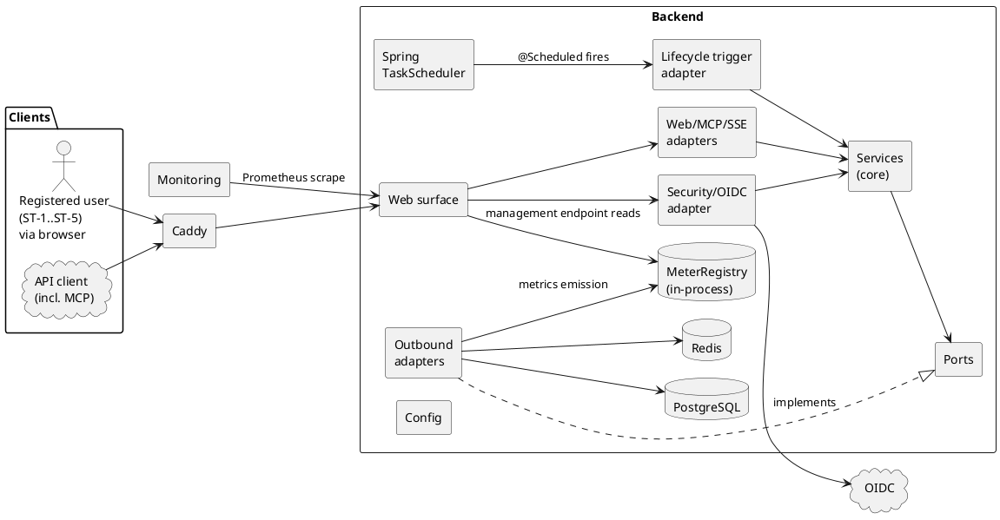

**Note.** `Config` edges are omitted to keep the diagram readable; see the `config/` row in §5.2.4 below for what it supplies and where it is injected.

#### 5.2.2 Backend Level 2

Three level-1 backend building blocks (§5.2.1) are opened at this level: `Services (core)`, opened into four intra-core service clusters by concern (each of those four clusters is opened further in §5.2.3); the `Web/MCP/SSE adapters` group; and the event-delivery channel inside `Outbound adapters` (the rest of `Outbound adapters` — persistence, metrics, session — is not opened separately at this level).

Services (core):

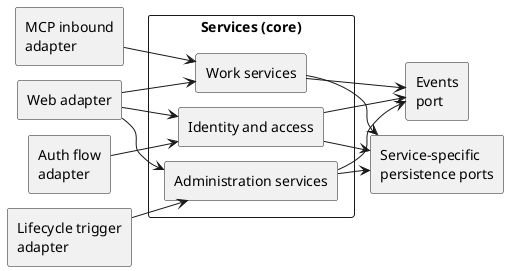

`Services (core)` opens into three clusters by concern: **Work services** (productive use cases on the node tree), **Identity and access** (user identity and delegated-access constructs), and **Administration services** (operator- and system-driven concerns). Inbound adapters fan into these clusters: the Web adapter reaches all three; the MCP inbound adapter reaches Work services only (per UR-00-C08); the Auth flow adapter feeds Identity and access; the Lifecycle trigger adapter feeds Administration services. Per-cluster persistence ports are shown grouped here; each is named explicitly inside the corresponding Level 3 view in §5.2.3.

Each adapter→cluster edge in the diagram is realised through an **inbound port interface** declared in `port/inbound/<cluster>/<service>/` and implemented by the corresponding service class in `service/<cluster>/<service>/`. Adapters depend on the interface, not on the service class. See §5.2.4 for the port-package structure.

Web/MCP/SSE adapters:

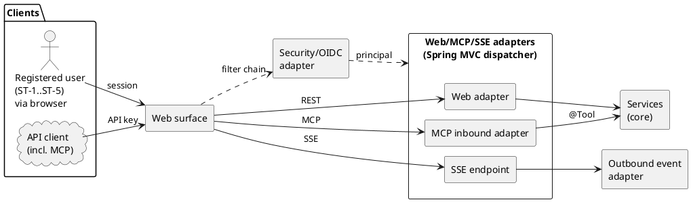

Inbound HTTP surface. All three handler categories (REST controllers, Spring AI MCP server, SSE endpoint) run on one Spring MVC dispatcher behind one Spring Security filter chain; the chain produces an OIDC-session principal (registered user) or an API-key principal (API client, with MCP as the protocol variant per the *MCP* glossary entry) before handler dispatch. The MCP "adapter" is mostly Spring AI configuration registering application-service methods as `@Tool` methods, not a parallel custom adapter package.

Outbound live-update delivery:

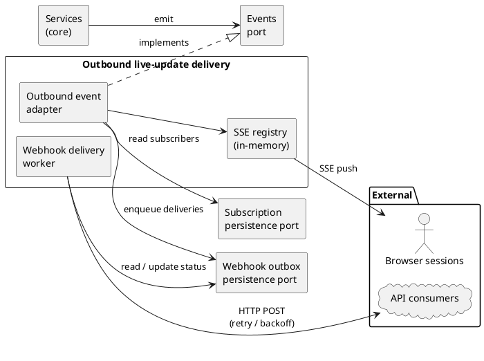

The path from Event port emission through SSE push to registered browser sessions and through a webhook delivery outbox to subscribed API consumers per UR-03-F12.

**Note.** `Config` injection edges are omitted from the three diagrams above per the §5.2.1 note.

Black boxes (level 2):

| Building block | Responsibility |
|---|---|
| Clients | Two external client categories accessing trawhile through the public web surface, mirroring the UR Client access context: registered users (ST-1..ST-5, via browser, OIDC session) and API clients (API key) — the latter using either REST or the MCP protocol per the *MCP* glossary entry. The auth axis (session vs API key) and the protocol axis (REST vs MCP) are independent: a single API client may invoke REST endpoints and MCP tools within the same API-key credential. |
| Event port | Provides contracts for visible-state notifications emitted by application services after mutating use cases. Downstream of the port the outbound event adapter fans out to two delivery channels: SSE for browser sessions and HTTP webhook for API consumers subscribed via the Authorization service (UR-03-F12). |
| MCP inbound adapter | The MCP HTTP transport provided by Spring AI's MCP server, plus the `@Tool`-annotated methods registered with it (typically on application services). Receives MCP tool calls on the shared Spring MVC dispatcher with an API-key-derived principal supplied by the Security/OIDC adapter, then invokes the target `@Tool` method. Appears in the Web/MCP/SSE-adapters view and the Work services view (§5.2.3) only. MCP tools are deliberately scoped to work-services use cases (time tracking data per the *MCP* glossary entry); broader API-client access to other services goes through the Web adapter's REST path per UR-00-C08. |
| Outbound event adapter | Implements the Event port across two channels. The SSE channel pushes events to registered browser-session emitters and keeps no replay buffer. The webhook channel reads per-user delivery configuration from the Authorization service, writes events for matched subscribers into a PostgreSQL-backed delivery outbox, and a background worker POSTs them with retry-and-backoff (at-least-once semantics; subscribers must be idempotent); permanently failing deliveries are surfaced rather than silently dropped. |
| Security/OIDC adapter | Inbound auth adapter (`adapter/inbound/security/`) that translates external auth events into the application's principal and use-case calls: OIDC callback handlers + login-flow outcome classification produce session-based principals for registered users; the API-key validation filter produces API-key principals for API clients (REST or MCP). The only element that distinguishes the two access paths. Spring Security framework wiring (filter chain, AuthenticationManager) is configuration in `config/`, not part of the adapter. |
| Services | Cross-view callee label referring to the `Services (core)` element of §5.2.1 (opened up as four service clusters in §5.2.3). Stands here for any application service reachable from inbound adapters. |
| SSE endpoint | Inbound adapter that accepts server-sent-event connections from authenticated browser sessions, registers each connection with the SSE registry under the user id, and tears it down on disconnect. |
| SSE registry | In-memory map from user id to active SSE emitters; populated by the SSE endpoint and consulted by the outbound event adapter to push events to live browser sessions. Not persistent — clients re-fetch state through REST after reconnect. |
| Subscription persistence port | Stores per-user live-update delivery configuration (endpoint URL, signing material, scope). Written by the Authorization service for UR-03-F12 CRUD and read by the outbound event adapter on every event emission to determine which API consumers should receive a delivery. |
| Web adapter | Inbound HTTP adapter that translates REST/UI requests into application-service calls. Authentication context comes from the Security/OIDC adapter as either an OIDC session (registered user via browser) or an API key (API client). Appears in the Web/MCP/SSE-adapters view and in every service-cluster view (§5.2.3). |
| Web surface | Receives proxied HTTP traffic and routes it to the appropriate web, MCP, SSE, or security entry point. |
| Webhook delivery worker | Background component that reads pending rows from the webhook outbox, POSTs them to subscriber endpoints with retry-and-backoff, updates row status, and surfaces permanently failing deliveries rather than silently discarding them. |
| Webhook outbox persistence port | PostgreSQL-backed queue of pending webhook deliveries with attempt count, last status, and next-retry timestamp. Written by the outbound event adapter when matching subscribers exist for an emitted event; read and updated by the webhook delivery worker. Provides at-least-once semantics; subscribers must be idempotent. |

#### 5.2.3 Backend Level 3

The four service clusters introduced in §5.2.2 (Services (core) whitebox) are opened below into their constituent services and per-service persistence ports. Each cluster diagram is followed by a short description of what it covers.

Work services:

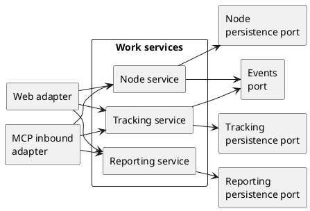

Productive use cases on the node tree (Nodes, Tracking, Reporting). Reachable by registered users via REST/UI and by API clients via REST or MCP. The set of operations exposed as MCP tools is a subset of these per the *MCP* glossary entry; broader API-client access to other services goes through REST per UR-00-C08.

Identity and access:

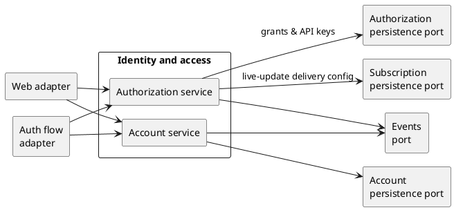

User identity (Account service, OIDC-session-only — registered users only per UR-00-C08(a)) and the delegated-access cluster — node-scoped grants, API keys, and live-update delivery subscriptions (Authorization service, reachable by registered users and, for Node Admin operations, by API clients per UR-00-C08).

Administration services:

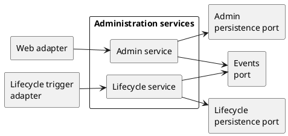

Operator- and system-driven concerns (Admin, Lifecycle).

Audit-event emission to the application log stream per UR-06-F01 is a cross-cutting concern handled via the logging framework (§8.5), not represented as a service.

**Note.** Two kinds of edge are omitted from the three diagrams above to keep them readable: runtime authorization-entry checks (the `AuthorizationService` call at method entry described in §6.2 — owned by the Authorization service and called by every peer that processes external-actor requests) and `Config` injection (per the §5.2.1 note).

Black boxes (level 3):

| Building block | Responsibility |
|---|---|
| Account service | Owns account/profile, OIDC provider linking, first-login completion, and account anonymisation use cases; carries account-specific business rules and transaction boundaries. |
| Admin service | Owns operator-side user-lifecycle management (deactivation, removal) and administrative overview actions. Node-scoped authorization grants, invitations, and API keys are owned by the Authorization service. |
| Auth flow adapter | Handles OIDC callback and login-flow entry points, classifies first-callback outcomes (bootstrap, invitation match, provider linking, known-identity login, rejected login per §6.1), and dispatches to the Account service (provider linking, activation of the pre-created user on invitation match) and to the Authorization service (root `admin` grant on bootstrap). Invitations link to pre-created users; the activation step does not produce new grants. |
| Authorization service | Owns the delegated-access constructs: node-scoped authorization grants (direct user grants and invitations as pending grants), API keys that scope a subset of the holder's effective authorization (issuance, listing, revocation, update, and System Admin oversight), and per-user live-update delivery configuration for API consumers (UR-03-F12). Implements `AuthorizationService` runtime entry checks called from peer application services for external-actor operations, by querying the same authorization model. |
| Lifecycle service | Owns scheduled and startup lifecycle work such as purge jobs, invitation expiry, user cleanup, and configuration validation. |
| Lifecycle trigger adapter | Invokes the Lifecycle service from scheduled or startup triggers. |
| Node service | Owns node tree administration use cases: create/edit/reorder/deactivate/reactivate/move. Node-scoped authorization grants are owned by the Authorization service. |
| Reporting service | Owns report, aggregation, chart, CSV/PDF export, filter persistence, and visibility-limited reporting use cases. |
| Service-specific persistence ports | Provide use-case-area-specific persistence contracts (Authorization, Account, Admin, Lifecycle, Node, Tracking, Reporting). Implemented by PostgreSQL-backed adapters; authorization-sensitive ports expose caller context explicitly so those adapters can enforce recursive node authorization structurally. |
| Tracking service | Owns current tracking state and time-record mutation use cases: start/switch/stop, retroactive create, edit, delete, duplicate, and write-path enforcement of the non-overlap and 3-year past/future bounds invariants. |

#### 5.2.4 Backend Package Layout

```text
com.trawhile
  adapter/
    inbound/
      lifecycle/
      mcp/
      security/
      sse/
      web/
    outbound/
      event/
        sse/
        webhook/
      metrics/
      persistence/
        authz/
        external/
          command/
          read/
        internal/
        row/
  config/
    session/             [Spring Session → Redis wiring]
  port/
    inbound/
      administration/   [Administration cluster use-case interfaces]
      identity/         [Identity and access cluster use-case interfaces]
      work/             [Work cluster use-case interfaces]
    model/              [shared port model types]
    outbound/
      event/
      metrics/
      persistence/
  service/
    administration/   [Administration services cluster]
      admin/
      lifecycle/
    identity/         [Identity and access cluster]
      account/
      authorization/
    work/             [Work services cluster]
      node/
      reporting/
      tracking/
  websurface/
```

The tree above is a structural index only. Each package's responsibilities are described in the table below; the table is the source of truth.

**Note on the inbound asymmetry.** `adapter/inbound/` is organised by **protocol** (`web`, `mcp`, `sse`, `security`, `lifecycle`) while `port/inbound/` is organised by **use-case cluster** (`work`, `identity`, `administration`). These axes are independent and the relationship between adapters and ports is n:m — one Web adapter calls into ports across multiple clusters; one Work cluster is called from both Web and MCP inbound adapters (see §5.2.2 Services (core) view). Forcing both sides onto a single axis would either group unrelated use cases by protocol or fragment a single protocol across clusters; the dual axis is canonical hexagonal architecture.

Main responsibilities:

| Building block | Responsibility |
|---|---|
| `adapter/inbound/lifecycle/` | scheduled and startup triggers for lifecycle work |
| `adapter/inbound/mcp/` | Spring AI MCP server configuration that registers `@Tool` methods (typically on application services) and routes MCP-protocol calls to them |
| `adapter/inbound/security/` | Inbound auth adapter: OIDC callback handling, provider linking, invitation, and bootstrap login-flow outcome classification; API-key validation for API clients (REST or MCP); principal building. Pure translation between auth protocols and the application-service interface — the only thing that distinguishes the registered-user-session path from the API-client path. Spring Security framework wiring (filter chain, AuthenticationManager) lives in `config/`. |
| `adapter/inbound/sse/` | SSE connection lifecycle and client registration |
| `adapter/inbound/web/` | REST/UI endpoints implemented as Spring `@RestController` classes; same routes serve registered users (browser, OIDC session) and API clients (API key) per UR-00-C08 |
| `adapter/outbound/event/` | live-update dispatch over two channels: SSE push to registered browser sessions, and HTTP webhook delivery to subscribed API consumers with an outbox-and-retry pattern to tolerate transient webhook failures |
| `adapter/outbound/metrics/` | Micrometer-based implementation of the metrics port; writes to an in-process `MeterRegistry` that the `websurface/` management endpoint exposes in Prometheus exposition format for the external Monitoring stack to scrape |
| `adapter/outbound/persistence/` | jOOQ/PostgreSQL implementations of persistence ports, including database-shaped records where needed |
| `config/` | Spring configuration: typed application properties (`application.yml` + env vars); Spring Security framework wiring (`SecurityFilterChain`, `AuthenticationManager`, CSRF/CORS/header config) consumed by `adapter/inbound/security/`; and Spring Session → Redis wiring (`config/session/`) consumed by Spring Security for HTTP-session storage. Injected by Spring into every other backend element: `WebSurface`, the inbound adapters (`Web/MCP/SSE adapters`, `Security/OIDC adapter`, `Lifecycle trigger adapter`), the application `Services`, and the `Outbound adapters`. Note: there is no `SessionPort` in the core — sessions are entirely a Spring Security / Spring Session concern; `config/session/` is configuration, not an adapter, and therefore lives here rather than under `adapter/outbound/`. |
| `MeterRegistry` (in-process Spring bean) | Singleton Micrometer registry; the in-process state store written by `adapter/outbound/metrics/` and read by `websurface/`'s `/actuator/prometheus` management endpoint to serve scrape requests from the external Monitoring stack. Not a source package — listed here because it appears as a distinct element in the §5.2.1 diagram, parallel to the external `PostgreSQL` and `Redis` stores. |
| `port/` | use-case-shaped ports owned by the application core, split by direction. `port/inbound/<cluster>/` declares the use-case interfaces (one per service, grouped by service cluster from §5.2.2 / §5.2.3) that inbound adapters depend on; service classes in `service/<cluster>/<svc>/` implement them. `port/outbound/` declares the contracts the core needs from outside (persistence, events, metrics); outbound adapters in `adapter/outbound/` implement them. `port/model/` holds shared model types referenced by both directions. The inbound interface layer documents the core's driver-facing API independently of the service implementation and lets adapter tests substitute interface mocks. |
| `service/` | application core: use-case flow, business rules, authorization entry checks, transaction boundaries. Organised into the three service clusters from §5.2.2 (`work/`, `identity/`, `administration/`); each cluster sub-package contains its constituent services as documented in §5.2.3. Each service class implements the corresponding inbound port interface in `port/inbound/<cluster>/`; inbound adapters depend on those interfaces rather than on service classes. Cross-cluster calls (notably the `AuthorizationService` entry check from every external-actor service into `identity/authorization/`) are explicit cross-package imports, surfacing inter-cluster coupling at PR review time. |
| `TaskScheduler` (Spring Boot auto-configured bean) | Spring's scheduler that fires `@Scheduled` methods on `adapter/inbound/lifecycle/` at architecture-defined fixed intervals (UR-00-C17, §6.4). The sole trigger source for the Lifecycle trigger adapter — there is no external (HTTP, MCP, user) entry path to that adapter. Not a source package — listed here because it appears as a distinct element in the §5.2.1 diagram. |
| `websurface/` | Spring HTTP entry surface that receives proxied requests, applies shared routing/error/management behavior, and dispatches to inbound adapters |

### 5.3 Frontend

The frontend is a single Angular responsive browser application served by the backend under the same public HTTPS origin. It is shaped by UR-00-C04 (responsive browser application) and UR-03-F12 (live updates across open sessions).

#### 5.3.1 Frontend Level 1

Frontend white-box structure:

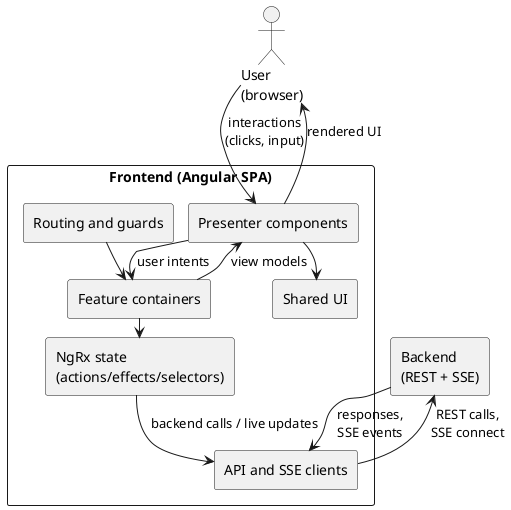

**Feature containers** and **Presenter components** are kept distinct per [ADR 0013](adr/0013-manage-frontend-state.md). Containers are route-connected, bind NgRx selectors to view models, and dispatch actions in response to user intents. Presenters receive `@Input` view models, emit `@Output` events, and never inject the store, router, or HTTP clients. The relationship is n:m: one container typically composes several presenters, and one presenter is typically reused in several containers (a node-tree view appears in tracking, reports, and admin pages).

#### 5.3.2 Frontend Level 2

Four level-1 frontend blackboxes are opened in this section: **Presenter components**, **Feature containers**, **NgRx state**, and **API and SSE clients**. The remaining two (Routing and guards, Shared UI) have minimal internal architectural structure and are covered by package listing only — see §5.3.3.

Durable business state remains backend-owned. The SPA stores server-derived read models, current-user/session state, loading/error state, and SSE-driven updates in NgRx where cross-component coordination is needed; purely local interaction state stays component-local. Responsive browser UI is implemented with the fixed Angular, PrimeNG, and Tailwind CSS stack; presenter components own layout and interaction rendering for desktop and mobile browser contexts.

Presenter components:

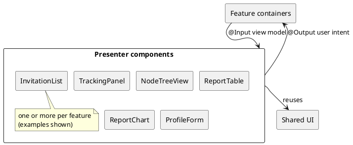

Each presenter is input/output only: it receives a view model from its parent container via `@Input` and emits user intents via `@Output`. Presenters never inject NgRx selectors, never call API services, never know about routing. They may hold purely UI-local state (e.g., a form draft, hover state) but never business state. This makes them trivially testable in isolation and replaceable without touching the rest of the SPA.

Feature containers:

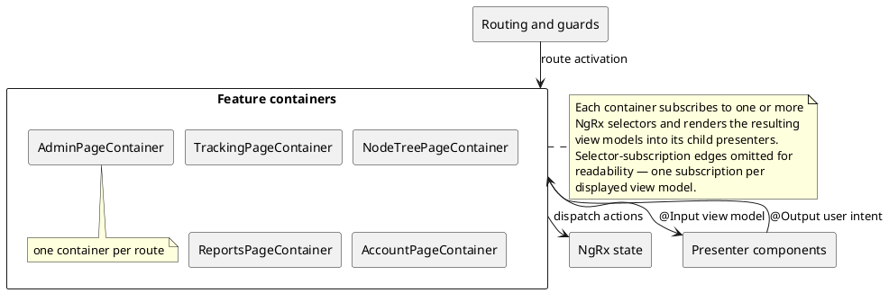

A container is the route-connected element of one feature. Its responsibility is purely orchestration: subscribe to the relevant NgRx selectors, translate selector streams into presenter `@Input` view models, dispatch NgRx actions in response to presenter `@Output` events, and react to route changes. Containers hold no business state of their own; they hold no template logic that isn't a thin pass-through to presenters.

NgRx state:

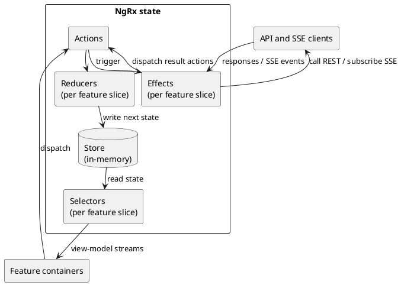

NgRx is organised by feature slice (Tracking, Nodes, Reports, Account, Admin). Each slice owns its actions, reducer, selectors, and effects. **Reducers** are pure functions that produce the next state from current state + action. **Effects** are the side-effect layer: they listen for specific actions, call the API/SSE clients, and dispatch result actions back into the pipeline. **SSE events arrive via Effects** that subscribe to the typed event dispatcher (see API and SSE clients below) and translate each event into an appropriate `*Updated` action. This is how the live-update channel from §6.3 lands in the frontend: SSE event → typed dispatcher → effect → action → reducer → store → selector → container → presenter.

API and SSE clients:

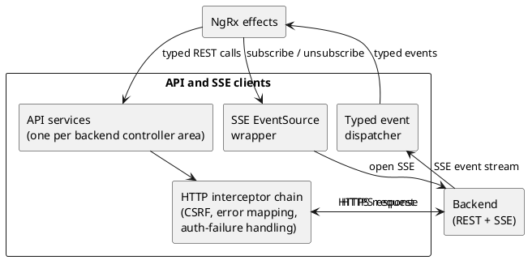

One typed **API service** per backend controller area (tracking, nodes, reports, account, admin, etc.) — each method maps to one REST endpoint with typed request/response models matching the OpenAPI contract. The shared **HTTP interceptor chain** handles cross-cutting concerns once: CSRF token injection (since cookies + CSRF are the auth on the REST side), error mapping (HTTP error → typed application error), and auth-failure handling (401 → routing back to login). The **SSE EventSource wrapper** owns one EventSource per authenticated session and unwraps incoming server-sent events into typed event objects via the **typed event dispatcher**; NgRx effects subscribe to the dispatcher rather than to the raw EventSource. Reconnection on dropped connections is handled in the wrapper, with a callback that lets effects re-fetch current state via REST before processing further events (the no-replay-buffer rule from §6.3).

#### 5.3.3 Frontend Level 3

Two Level-2 frontend blackboxes have non-trivial internal sub-structure worth opening: **NgRx state** (organised by feature slice) and **API and SSE clients** (typed services per backend controller area, plus the SSE event taxonomy). The other Level-2 boxes (Containers, Presenters) have no further architectural sub-structure: their internals are page-specific or component-specific implementations of patterns already established at Level 2.

NgRx slices:

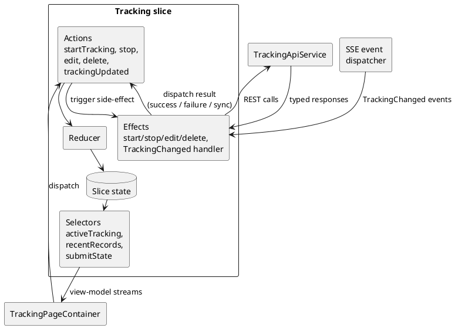

The diagram shows the **Tracking** slice as a representative example; the other four slices (Nodes, Reports, Account, Admin) follow the same shape with feature-specific actions, selectors, and effects. Each slice owns its own piece of the NgRx store. Reducers are pure; effects are the side-effect layer that calls API services and consumes SSE events.

| Slice | Concern | Key actions | Key effects |
|---|---|---|---|
| Tracking | Live tracking state, time-record CRUD | `startTracking`, `stopTracking`, `editRecord`, `deleteRecord`, `trackingUpdated` (from SSE) | Start/stop/edit/delete API calls; `TrackingChanged` SSE handler |
| Nodes | Node tree, node CRUD, quick-access, authorization listings | `loadNodeTree`, `createNode`, `editNode`, `moveNode`, `(de)activateNode`, `grantAuthorization`, `revokeAuthorization`, `nodeTreeChanged` (from SSE) | Node CRUD API calls; authorization CRUD; `NodeTreeChanged` and `AuthorizationChanged` SSE handlers |
| Reports | Report filter, aggregated read models, charts, export | `applyFilter`, `loadReport`, `requestCsvExport`, `requestPdfExport` | Report query API call; CSV/PDF export downloads |
| Account | Profile, OIDC provider linking, API-key lifecycle, anonymisation | `loadProfile`, `linkProvider`, `unlinkProvider`, `anonymiseAccount`, `generateApiKey`, `revokeApiKey`, `updateApiKey` | Profile read; OIDC link/unlink; API-key CRUD; anonymise call |
| Admin | User list, invitations, admin-side authorization view, log access | `loadUsers`, `createInvitation`, `resendInvitation`, `withdrawInvitation`, `removeUser` | User-management API calls |

**Cross-slice coordination.** Slices are largely independent, but a few read each other's selectors via the central store:

- Tracking effects need the current user id (Account slice) to scope server queries.
- Admin's user-management actions can trigger Account-slice reloads (e.g., if a user is removed while their session is open elsewhere).
- All slices share a `currentUser` selector exposed by Account for personalisation.

These shared references are read-only across slices; one slice never dispatches actions into another slice's reducer.

API services and event taxonomy:

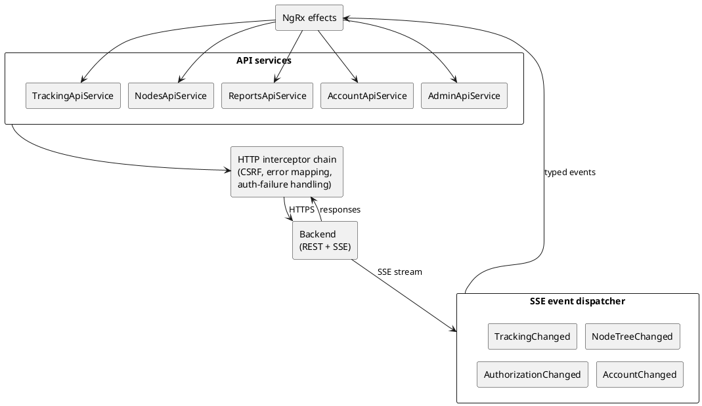

**One API service per backend controller area.** Each API service is a typed wrapper over the OpenAPI contract for one controller (the inbound `adapter/inbound/web/` group from §5.2). Methods map 1:1 to REST endpoints; request and response types are generated from `spec/openapi.yaml`.

**Typed SSE event taxonomy.** The dispatcher emits a small set of typed events. Per [ADR 0017](adr/0017-shape-sse-event-payloads.md), each event is either **snapshot** (payload is the current state of the affected resource for the recipient, exactly the shape of the corresponding REST query response) or **command** (payload describes an action whose effect cannot be derived from current state). NgRx effects subscribe to the event types they care about and translate them into slice actions; for snapshot events the action is the same `*Loaded` action used on initial REST load.

| Event type | Kind | Payload | Consumed by (effects in) |
|---|---|---|---|
| `TrackingChanged` | snapshot | The recipient's current `TimeRecord` (or `null` if stopped) — same shape as `GET /api/tracking/current` | Tracking slice |
| `NodeTreeChanged` | snapshot | The recipient's full visible node subtree — same shape as `GET /api/nodes/tree` | Nodes slice; Tracking slice (quick-access annotations) |
| `AuthorizationChanged` | snapshot | The recipient's full effective-authorizations list — same shape as `GET /api/account/me/authorizations` | Nodes slice (visibility refresh); Account slice (own-authorizations refresh) |
| `AccountChanged` | snapshot | The recipient's profile snapshot — same shape as `GET /api/account/me` | Account slice |
| `InvitationWithdrawn` | command | The withdrawn invitation's id and the inviter's pseudonymous id | Account slice |
| `AccountAnonymisedByAdmin` | command | The action timestamp; no state remains for the recipient to read | Account slice (sign-out flow) |

The dispatcher is the single ingress point for SSE events into NgRx; the raw `EventSource` is encapsulated by the SSE wrapper from §5.3.2 and never leaks into slice code. Effects handling snapshot events dispatch the relevant slice's `*Loaded` action with the payload, so the reducer path is identical to a REST-driven load and the slice is correct regardless of whether intermediate events were missed.

#### 5.3.4 Frontend Package Layout

```text
src/app/
  core/
    auth/       guards and authentication helpers
    http/       CSRF and error interceptors
    sse/        EventSource wrapper and typed event dispatch
    api/        one service per backend controller area
    state/      root NgRx store configuration
  features/
    <feature>/
      state/       feature actions, effects, reducers, selectors
      containers/  route-connected components
      presenters/  input/output-only view components
    tracking/
    nodes/
    reports/
    account/
    admin/
    cross-cutting/
  shared/
    components/
    pipes/
```

## 6. Runtime View

### 6.1 OIDC Login and Registration

Spring Security owns the OIDC callback path. The OIDC user service and success handling distinguish the following first-callback outcomes:

- **First-admin bootstrap.** The email returned by OIDC matches `BOOTSTRAP_ADMIN_EMAIL` and no users exist yet. The Account service creates the user, the Authorization service grants `admin` on the root node, and the OIDC provider is linked to the new user (UR-01-F01).
- **Invitation match.** The email returned by OIDC matches a still-pending invitation, which is linked to a user record pre-created when the invitation was issued (per the *Pending invitation* glossary entry). The Account service links the OIDC provider to that pre-created user, activates it, and the invitation is deleted (UR-01-F13). Any node grants assigned to the user while it was pending remain on the now-active user; no grants are produced by the activation step itself.
- **Provider linking.** The browser session is already authenticated; the new provider identity is added to that user's linked providers (UR-05-F02).
- **Known-identity login.** The provider identity is already linked to an active user; the session continues normally (UR-01-F14).
- **Rejected login.** None of the above match. The callback is rejected without revealing whether the email is known to the system (UR-00-C22).

Transparency about retained personal data is reachable from the About page after sign-in (UR-05-F06).

Email addresses returned by the OIDC `email` claim are persisted on the user record (`users.email`) on every successful authenticated callback, supporting admin user-list display, invitation handling, and audit investigation (UR-00-C11). Application log entries continue to redact email per UR-00-C14; the admin lookup function of UR-06-F05 is the surface where the System Admin resolves identifiers to identities.

### 6.2 Authorized Business Operation

Typical mutation flow:

```text
Controller
  -> service method
  -> AuthorizationService check at method entry
  -> business invariant checks
  -> persistence command/read call
  -> transaction commit
  -> Event port emission (fans out to SSE and webhook channels per §6.3)
```

`AuthorizationService` is the runtime check entry point owned by the Authorization service (§5.2.3). It evaluates the recursive node-authorization model that the same service also mutates through grant, invitation, and API-key use cases. When a check denies, the Authorization service emits the failure as an audit event into the application log stream (§8.5).

Sensitive persistence commands also encode authorization inside the SQL statement to avoid check-then-mutate gaps.

### 6.3 Live Updates

Live-update emission is uniform: application services call the Event port after a mutating use case completes, and the outbound event adapter fans out the visible-state change (tracking, node tree, authorizations) to two delivery channels.

**Browser channel (SSE).** The browser opens one SSE connection for the authenticated session; the backend registers an `SseEmitter` under the user id and pushes events without polling. Event payloads follow a hybrid shape per [ADR 0017](adr/0017-shape-sse-event-payloads.md): **state-shaped** events (tracking, node tree, authorizations, profile) carry a snapshot whose payload type is exactly the response type of the corresponding REST query for the recipient's visible slice, so the same backend service method serves both channels and receipt is idempotent; **action-shaped** events (e.g., invitation withdrawn, account anonymised by admin) carry a command describing what happened. The server keeps no replay buffer, so on dropped connections the browser `EventSource` reconnects; the frontend re-fetches current state through REST as the recovery path for command topics and as the initial-load mechanism for snapshot topics.

**API channel (webhook).** Per UR-03-F12, Account Holders may configure outbound live-update delivery for their delegated API access; the configuration is owned by the Authorization service. For each emitted event, the outbound event adapter writes a record into a PostgreSQL-backed delivery outbox for every matched subscriber, and a background worker POSTs the payload to the subscriber's endpoint with retry-and-backoff. The outbox provides at-least-once semantics under transient subscriber downtime; subscribers must be idempotent on event consumption. Permanently failing deliveries are surfaced for inspection rather than silently discarded.

### 6.4 Lifecycle Jobs

The application runs a small set of scheduled jobs that enforce time-bounded rules and the data retention policy (UR-00-C17). All jobs run on architecture-defined fixed intervals (not operator-configurable), are idempotent on restart, and process long-running work in chunks; each chunk runs in its own RDBMS transaction and updates `purge_jobs` progress so startup recovery can resume from the stored cutoff date. Scheduling is single-process: the Spring `TaskScheduler` bean in the one running `app` container fires each `@Scheduled` method without leader election, distributed locks, or any other coordination primitive — this is consistent with the single-VPS deployment model of UR-00-C12 and is part of why the architecture does not require a broker or consensus service.

| Job | What it does | Source |
|---|---|---|
| Data retention purge | Deletes time records whose counted-duration end is past the 3-year boundary. Deletes nodes whose subtree holds no remaining time records and whose own creation time is past the boundary (processed bottom-up). | UR-00-C17 |
| Invitation expiry | Deletes pending invitations and their pre-created user records 90 days after issuance. | UR-00-C13 |
| Open time-record auto-close | Closes open time records that exceed the 24-hour duration cap. | Key invariants |

### 6.5 Account Lifecycle

Account access termination uses one atomic cleanup path (UR-07-F01) for invitation expiry, invitation withdrawal, self-anonymisation, and administrative removal. Pending users are deleted entirely along with the invitation (per the *Pending invitation* glossary entry). Active users have their identifying account data anonymised; the resulting anonymised account stub persists indefinitely. The stub contains no personal data (no email, no OIDC subject id), so it is not subject to data minimisation. Permanent persistence decouples the data retention purge (UR-00-C17, §6.4) from the log retention window (UR-00-C15) so that pseudonym lookup (UR-06-F05) and owner references on retained historical records keep working regardless of which clock runs out first.

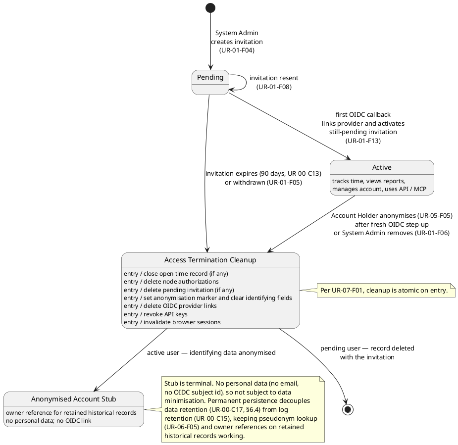

## 7. Deployment View

The reference Docker Compose deployment ships the trawhile-provided services below per UR-00-C07. The operator provisions the underlying deployment platform and the backup storage target; restore is performed by the operator following project-provided documentation, not by an in-app or in-tooling restore command (UR-07-F02).

Production deployment:

```text
Caddy
  -> Spring Boot application container
       serves REST API and Angular static files
       emits structured application log entries (incl. audit events per §8.5)
      -> Redis container
           stores interactive user sessions
  -> PostgreSQL container
Log-pipeline container
  <- captures application log entries from `app` (and supporting services)
  enforces 3-year retention per UR-00-C15
Backup-creation container
  -> operator-provisioned backup storage target
  (no restore counterpart)
```

Docker Compose services:

| Service | Responsibility |
|---|---|
| `caddy` | HTTPS, TLS certificates, reverse proxy |
| `app` | Spring Boot backend and static Angular SPA; emits structured application log entries, including audit records per §8.5 |
| `redis` | Spring Session backing store for interactive user sessions |
| `db` | PostgreSQL database |
| `log-pipeline` | Captures application log entries from `app` (and supporting services), enforces fixed 3-year retention per UR-00-C15 at the pipeline boundary, preserves correlation identifiers per UR-00-C16, and is the surface through which ST-5 reads logs per UR-01-F11. Realised as Grafana Loki (storage and LogQL query API) plus Promtail (per-host log tailer) per ADR 0018; the LogQL query surface is exposed to operators through the Monitoring stack's Grafana via Explore. Log payload constraints are owned by emitters (UR-00-C14) |
| `backup` | Periodic backup-creation tooling for trawhile-managed persistent data; writes artifacts to an operator-provisioned external storage target. Provides no restore command — the operator follows project-provided restore documentation (UR-07-F02). Artifact validity and restorability are covered by automated tests per UR-00-C09 |

Configuration is supplied through environment variables and mounted `application.yml`. There is no database settings table. Log retention is enforced by `log-pipeline` configuration, not by application code or manual deletion.

Native development uses PostgreSQL from `make development-db`, Spring Boot from `./scripts/mvn-local.sh spring-boot:run`, and Angular separately through `ng serve`. The `log-pipeline` and `backup` services are not part of the native dev loop.

## 8. Cross-cutting Concepts

### 8.1 Persistence

Durable business state is relational and PostgreSQL-backed. The database is the system of record for users, node hierarchy, authorizations, API keys, live-update delivery subscriptions and their outbox, time records, lifecycle job state, and other long-lived business data. Audit events are not stored in the database; they are emitted to the application log stream per §8.5.

The application core does not depend on database APIs directly. Services use persistence ports shaped around use cases, reads, commands, and internal system operations. PostgreSQL and jOOQ are implementation concerns of the outbound persistence adapter.

Persistence follows a lightweight CQRS-style split. Read components build read models for queries and reporting. Command components implement state-changing operations. This split is structural only; there is one relational data model and no separate read database or event-sourced write model.

Persistence access is SQL-first. New persistence code uses jOOQ-generated schema objects and the jOOQ DSL wherever practical, so joins, casts, column names, and bind parameters are checked earlier than with broad hand-written SQL strings. Plain SQL remains an exception for PostgreSQL constructs that jOOQ cannot reasonably express or model.

The persistence adapter separates external-actor access paths from internal system access paths. External read and command components expose caller scope in their APIs so authorization can be applied structurally. Internal system components are reserved for lifecycle jobs, retention cleanup, startup repair, and similar operations that are not initiated by an external actor.

### 8.2 Authorization

Authorization is recursive over the node tree. Grants on ancestor nodes affect descendant visibility and permissions.

Services call `AuthorizationService` at method entry for external-actor operations. External read and command SQL also enforces authorization in the database query or command instead of loading broad result sets and filtering in Java.

PostgreSQL authorization functions centralize recursive node visibility and authorization checks. External read and command SQL joins or left-joins those functions, or uses named wrappers derived from them when a join shape is not suitable.

Internal system operations use separate persistence components and do not require caller authorization semantics.

If the relational database product changes, the authorization functions and generated SQL bindings must be reimplemented for the new database.

### 8.3 Transactions and Consistency

Application service use-case methods define transaction scopes. They expose business operations, not `beginTransaction` or `commitTransaction` operations. Inbound adapters translate requests into use-case calls and do not define database transaction scope. Persistence adapters participate in the transaction scope of the calling application service; they do not define independent business transaction boundaries.

RDBMS transaction handling is implicit at the use-case boundary. Spring's transaction manager opens, commits, or rolls back the transaction for the PostgreSQL-backed JDBC data source around the application service method. Authorization entry checks, business invariant checks, persistence reads, and persistence commands that belong to one use case run inside one RDBMS transaction where consistency requires it.

There are no distributed transactions across PostgreSQL, Redis session state, SSE delivery, Caddy, or external OIDC providers. Non-database side effects must tolerate retry, reconnect, or refetch behaviour.

Background job chunks use separate RDBMS transactions so long-running lifecycle work does not hold one transaction open for the entire job.

### 8.4 Security

The public application surface is Caddy-managed and HTTPS-only. If plain HTTP is exposed, it is used only for redirect or certificate-validation traffic, not for serving application traffic.

Caddy owns TLS termination and baseline edge abuse controls before requests reach Spring Boot. These controls include request-rate limiting, request and connection timeouts, and operational observability through edge logs and metrics.

Spring Security owns browser authentication, OIDC/OAuth2 login handling, interactive sessions, CSRF protection, and response security headers. Interactive browser sessions are backed by Spring Session in Redis with a finite inactivity timeout. Session cookies are browser-session security artefacts and must be configured for secure same-origin use.

The production browser surface is same-origin: the SPA, application API, OAuth2 callback paths, and SSE endpoint share one public origin behind Caddy. Credentialed browser calls therefore do not require CORS in production.

API clients (incl. MCP, per the *MCP* glossary entry) do not use interactive sessions as their authentication mechanism. They authenticate requests with API keys carried as bearer tokens and still enter external-actor authorization paths in the application.

API keys are returned once at generation, stored only as hashes, and can expire or be revoked. Revoked or expired keys are rejected before the request enters use-case handling.

Per UR-00-C22, no anonymous response — error pages, response headers, OIDC callback redirects, or any endpoint reachable without authentication — reveals trawhile's version, dependency set, OpenAPI surface, or outbound network behaviour. Server-version headers from Caddy and Spring Boot are stripped at the edge, error responses to unauthenticated requests are generic, and the version, OpenAPI download, outbound-connection list, and disclosure/advisory links live only on the auth-gated About page (UR-05-F06).

Every write request is validated server-side regardless of any client-side checks. Server-side validation covers field rules (type, format, length), cross-record invariants (the key invariants in `requirements-ur.md`, e.g. no overlapping time records per user, no last-admin revocation, retention bounds), authorization (§8.2), and business rules. Validation failures are returned through the OpenAPI `Problem` response shape (§8.7). Client-side validation in the SPA is purely a UX accelerator that prevents obviously broken submissions from reaching the network; it is never a security or correctness gate. The same rule applies to API and MCP clients: there is no privileged write path that skips server-side checks.

### 8.5 Audit and Security Observability

Audit-relevant events are emitted as structured records into the trawhile application log stream per UR-06-F01, not stored as durable database rows. These include OIDC login success and failure, authorization failures, node authorization grants and revocations, account anonymisation, user removal, lifecycle purge executions, and API key generation, use, and revocation.

Each audit record carries event type, actor identifier, target identifier, timestamp, and the correlation identifiers required by UR-00-C16 so audit entries can be linked with related operational entries during investigation. Actor identifiers are pseudonymous (internal user UUID or OIDC subject); the System Admin resolves them to user accounts through the user-lookup capability defined by UR-06-F05.

Audit records share the application-log retention regime: subject to UR-00-C14 (no personal data), retained per UR-00-C15 for 3 years, and accessed through the trawhile-provided logging infrastructure per UR-01-F11. Access control over that infrastructure is an operational concern of the deployment, not a separate application-level RBAC layer over an audit table.

Caddy edge abuse-control events, such as public rate-limit rejections and timeout behaviour, are observed through Caddy logs and metrics rather than the application log stream.

Application log entries, metrics, and audit records must not contain raw API keys, OAuth client secrets, database credentials, or personal data beyond the pseudonymous correlation identifiers described above.

### 8.6 Privacy and Data Minimisation

Registered users are identified by provider and subject id (the (provider, subject) pair on `user_oauth_providers`); the email address (`users.email`) is persisted alongside per UR-00-C11 for admin user-list display, invitation handling, and audit investigation, and is refreshed from the OIDC `email` claim on each successful sign-in. Email is cleared during anonymisation.

Temporary login-flow state for bootstrap, invitation registration, and provider linking is session state, not durable business data. OIDC profile pictures are not stored.

Account anonymisation and user-removal flows remove profile data, revoke active API keys, delete authorizations, and retain only anonymous stubs where historical time records require referential integrity.

Retention and scrubbing are scheduled lifecycle concerns. Pending invitations expire automatically per UR-00-C13, and business data is retained per the fixed 3-year retention policy (UR-00-C17, §6.4). Authenticated transparency over what personal data is stored and for how long is provided by the personal-data summary on the About page (UR-05-F06).

### 8.7 Error Handling

API errors use the OpenAPI `Problem` response shape. A global exception handler maps typed domain exceptions to HTTP status codes and stable error codes.

### 8.8 Configuration

System configuration is externalized through `application.yml` and environment variables, bound by `TrawhileConfig`, and validated at startup.

Secrets such as database credentials, OAuth client secrets, and bootstrap-admin configuration are supplied through environment-specific mechanisms and must not be committed in application configuration files.

### 8.9 Live Updates

Two delivery channels share one Event port emission point (§6.3). SSE is the browser channel; the server keeps no replay buffer, and reconnecting clients re-fetch current state from REST as recovery for command-shaped events and as initial-load for snapshot-shaped events (event-payload shape policy per ADR 0017). Outbound HTTP webhook is the API channel per UR-03-F12; a PostgreSQL-backed delivery outbox with retry-and-backoff provides at-least-once delivery under transient subscriber failure, and subscribers are expected to be idempotent.

### 8.10 Vulnerability Disclosure and Advisories

The deployed instance and the trawhile project interact with GitHub for the OSS security flow defined by UR-00-C05.

**Inbound disclosure.** The deployed instance exposes no inbound disclosure surface. ST-6 (Security Researcher) reports vulnerabilities directly to the project through GitHub's private vulnerability reporting channel. The maintainer triages reports and publishes GitHub Security Advisories (GHSA) where warranted.

**Outbound advisory delivery.** The deployed instance does not query GitHub for advisories. The About page links to the project's GHSA index (UR-06-F02) and a guided admin-UI page walks the System Admin through subscribing to advisory notifications via GitHub's native mechanisms (watching the repository for security alerts, or subscribing incident-response tooling to the per-repo GHSA Atom feed) per UR-06-F03. Advisory awareness is therefore operator-driven through GitHub; the deployed instance carries no in-app advisory list, no periodic poll, and no advisory cache.

**Transparency surface.** The About page (UR-05-F06) is the single authenticated transparency surface: running application version, third-party licenses, downloadable OpenAPI specification, permanent personal-data summary, outbound network connections (currently OIDC token-exchange and user-configured webhook deliveries — no advisory traffic), and links to the disclosure and advisory channels. It is not reachable without authentication; SBOM is published only as a GitHub release artifact, never served by the deployed instance.

### 8.11 Localization

Per UR-00-C18, UI text is rendered in the language derived from the user's browser locale — best match against English, German, French, and Spanish, default English. Localization is a frontend concern owned by ngx-translate: the active language is resolved at SPA startup from the browser and supplied to presenter components. The user record stores no language preference, session state stores no language, and operator configuration exposes no language setting.

The backend stays language-neutral. API error responses follow the OpenAPI `Problem` shape with stable error codes (§8.7); the frontend maps codes to user-facing messages in the active language. Audit and operational log entries (§8.5) are developer-facing diagnostics and are emitted in English; they are not subject to UI translation.

The bounded language set keeps translation effort manageable; adding a language is a frontend translation-file change that does not affect server contracts or persistence.

### 8.12 Time

Per UR-00-C10, all persisted and exchanged timestamps are UTC. The constraint applies uniformly to PostgreSQL storage, persistence DTOs, API payloads, and internal application types; the backend uses `java.time.Instant` (UTC by construction) for in-memory representation. No per-record timezone metadata is stored anywhere.

Timezone handling is a frontend concern. The SPA converts UTC instants to the user's browser-local time for display, accepts user-entered times in local form, and converts back to UTC before submission. The user record, session state, and operator configuration carry no timezone setting.

Aligned with the localization model in §8.11, this keeps the backend free of per-user time-presentation concerns and the data model free of denormalisation across deployments in different geographies.

## 9. Architecture Decisions

Architecture decisions are maintained as ADRs under [docs/adr](adr/).

## 10. Quality Requirements

Quality requirements and acceptance criteria are defined in:

- [System requirements](requirements-sr.md)
- [Test plan](../spec/test-plan.md)

Architecturally significant quality drivers include:

- authorization correctness and non-disclosure
- data minimization and retention correctness
- predictable single-tenant deployment
- prompt propagation of visible state changes to active user sessions
- traceability from requirements to tests
- CI security gates for high and critical findings

## 11. Risks and Technical Debt

| Risk or debt | Treatment |
|---|---|
| Authorization correctness depends on PostgreSQL-specific logic | keep PostgreSQL-backed integration tests for authorization primitives, reads, and commands |
| SSE has no replay buffer | clients re-fetch current state on reconnect |
| Derived schema artifacts can drift if edited manually | regenerate derived artifacts from the agreed data model for the current process phase and review generated output |

## 12. Glossary

Terminology is defined in the Glossary section of [docs/requirements-ur.md](requirements-ur.md).
