# User requirements (UR)

Functional requirements use the format: "The [stakeholder] shall be able to [capability]. [Goal: reason]"
Constraint requirements state design-time conditions that are satisfied by construction and verified by review.

## Glossary

Terms are listed alphabetically. Where a term appears in this document or in architecture and downstream documents, it is used with the meaning defined here.

**Anonymization** Irreversible removal of the link between a person and their retained trawhile activity history. Identifying account data and active delegated access are removed, replaced, or invalidated so the person can no longer be identified through the retained account state. Retained activity history remains subject to the retention period. The anonymised user can re-register only with a new invitation, which creates a new, unlinked identity.

**API key** A long-lived secret generated by an Account Holder to authorize an API or MCP client to act on their behalf within the key's scope. The raw key is shown once and never retrievable; the system stores only a secure hash. API keys have a required expiry and are revocable at any time.

**Authorization level** One of three permission levels (`view`, `track`, `admin`) that can be granted to a user on a node. They form a strict subset hierarchy: `view` ⊂ `track` ⊂ `admin`. A grant of a higher level implies all lower levels. See also: *effective authorization*, *node authorization*.

**Bootstrap** The one-time process of creating the first System Admin. Because no admin can exist before any user logs in, the `BOOTSTRAP_ADMIN_EMAIL` environment variable designates the email address that receives `admin` on the root node on first OIDC login.

**Effective authorization** The highest authorization level a user holds on a specific node, considering both direct grants on that node and grants on any ancestor node. A grant on an ancestor is effective on all descendants — this is the core authorization model.

**MCP (Model Context Protocol)** An open protocol that allows AI assistants and other clients to invoke structured tools on a server. trawhile implements an MCP server that exposes time tracking data (time records, node tree, member summaries) to authorized MCP clients using API-key authentication.

**Node** The fundamental organizational unit of trawhile's hierarchy. A node can represent anything the company chooses to track time against: a project, work package, task, team, absence type, etc. Nodes form a tree; the root node is the unique top-level ancestor. Each node has a name, optional description, color, icon, and logo. See also: *trackable*.

**Node authorization** A grant of a specific *authorization level* (`view`, `track`, or `admin`) to a specific user on a specific node. One user may hold at most one authorization per node (stored as the highest granted level). See also: *effective authorization*.

**Non-trackable** The negation of *trackable*: a node fails at least one trackability condition for a given user. A non-trackable node may still appear in the user's quick-access list, node picker, or node tree; new time records cannot be started against it.

**OIDC (OpenID Connect)** An identity layer built on top of OAuth 2.0. trawhile delegates all authentication to configured OIDC providers (Google, Apple, Microsoft Entra ID, Keycloak) and stores only the provider name and the provider's subject ID — never an email address or password.

**Operator** The person responsible for deploying and maintaining the trawhile instance (Docker Compose, config file, backups). In practice this is typically the same person as the System Admin (ST-5).

**Pending invitation** A record created when a System Admin invites a person by email address. Contains the email and is linked to a pre-created user. Deleted when the invitee completes their first OIDC login. Expires automatically after 90 days; expiry deletes both the invitation and the associated user.

**Purge** The scheduled batch deletion of time records and unreferenced nodes past the fixed retention boundary. Runs on a fixed interval and is idempotent on restart. See also: *retention period*.

**Quick access** A user's personal list of nodes for fast tracking start, ordered by the user. Nodes remain in the list even when the user can no longer start live tracking from them (deactivated, gained active children, or lost track authorization); such entries are annotated to indicate live tracking cannot be started against them and are not removed automatically.

**Retention period** Fixed at 3 years, measured to the second from the current moment. Time records past this boundary are permanently deleted by the next purge; the boundary is evaluated against the end of each record's counted duration. Nodes are deleted once their subtree holds no remaining time records and the node itself is past the boundary. Not operator-configurable.

**Root node** The unique top-level node in the tree. All other nodes are descendants of the root. A user with `admin` on the root node is a System Admin and has effective authorization over the entire tree.

**System Admin** An Account Holder with effective `admin` authorization on the root node. Has full scope over the entire node tree: all Node Admin capabilities across all nodes, plus user management and system settings access. IS-A Node Admin IS-A Tracker IS-A Viewer IS-A Account Holder. Typically also the person who deployed the instance (operator). See ST-5.

**Trackable** A node is trackable for a given user when (a) the node has no active children and (b) the user holds at least `track` *authorization level* on the node. A trackable node can receive retroactive time records and accept edits to existing records on it. Starting a *live* tracking record additionally requires the node to be active; deactivated trackable nodes accept retroactive create and edit but not live-tracking start. Trackability is derived from these conditions, not stored as a separate flag on the node.

**Tracking** The act of recording time spent against a node. Each tracking interval is captured as a *time record*: a record is *open* while tracking is ongoing and *closed* once it has an end. A user may have at most one open time record at any time. Tracking is always user-initiated; the system never starts tracking automatically. A single time record counts for at most 24 hours, and open records exceeding this duration are eventually auto-closed (see key invariants).

**User** A generic term for a registered person using trawhile. Where a requirement needs a specific capability boundary, it names the stakeholder role instead: Account Holder (ST-1), Viewer (ST-2), Tracker (ST-3), Node Admin (ST-4), or System Admin (ST-5).

## Stakeholders

ST-1 through ST-5 are roles that any registered person can hold, not separate classes of person. The in-application roles are hierarchical and additive: System Admin IS-A Node Admin IS-A Tracker IS-A Viewer IS-A Account Holder. API clients are not a stakeholder role; they are an access channel through which a Viewer, Tracker, or Node Admin acts.

| ID | Type | Stakeholder | Interests |
|---|---|---|---|
| ST-1 | Person | Account Holder — any registered member (matched a pending invitation, completed OIDC login); scope covers their own account only; ST-1 operations require an OIDC-authenticated session and are not reachable via API key unless explicitly stated otherwise | Identity-provider linkage, API-key lifecycle control, transparency over own profile and personal-data handling, GDPR right to anonymisation |
| ST-2 | Person/Client | Viewer — an Account Holder with at least `view` authorization on a node; scope covers that node and all descendants according to effective authorization | Node visibility, reporting over visible nodes, awareness of own access scope, delegation of visible read access to automated clients via API key |
| ST-3 | Person/Client | Tracker — an Account Holder with at least `track` authorization on a node; scope covers that node and all descendants according to effective authorization | Time tracking, time-record maintenance, quick access, delegation of tracking work to automated clients via API key |
| ST-4 | Person/Client | Node Admin — an Account Holder with `admin` authorization on a node; scope covers that node and all descendants according to effective authorization | Node structure management, authorization assignment, delegation of node-administration work to automated clients via API key |
| ST-5 | Person | System Admin — an Account Holder with `admin` authorization on the root node; scope covers the full tree; also typically the person who deployed and operates the instance; ST-5 operations require an OIDC-authenticated session and are not reachable via API key | User management, system configuration, security audit, monitoring and incident response, backup oversight, stable and secure operation |
| ST-6 | Person/Organization | Security Researcher — an external person or organization that discovers vulnerabilities in trawhile and reports them to the trawhile project through the publicly accessible disclosure channel | Predictable and reachable disclosure channel, coordinated disclosure handling, optional attribution |

## System context

The system context defines the trawhile system-to-be and the neighboring systems, infrastructure, and regulatory frameworks that interact with or constrain it. Stakeholders are covered in the section above.

### System context diagram

The system context is split into three views: client access, instance operations, and OSS security flows. Components inside the trawhile rectangle are provided by the trawhile project; neighboring infrastructure is operated by ST-5; external platforms such as GitHub are outside operator control. ST-5 appears both as an authenticated admin user and as the instance operator.

#### Client access context

**Clients** groups the actors that interact with the application surface: registered users (ST-1 through ST-5) via OIDC-authenticated session; and API clients acting through an Account Holder's API key. MCP clients are the protocol variant of API clients for AI assistants. The deployed instance has no anonymous content surface — all endpoints require authentication. **Infrastructure** contains the OIDC providers used for delegated authentication. The System Admin's email client is shown as a neighboring client-side tool because trawhile generates invitation `mailto:` links but does not send email itself.

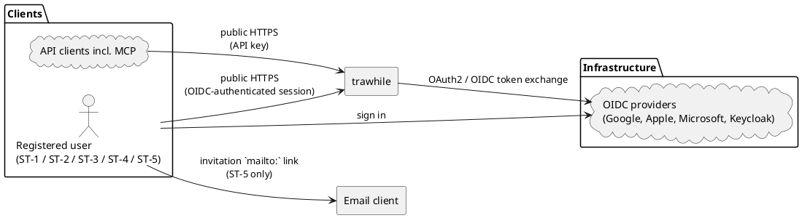

#### Instance operations context

**Operations** groups the operator role responsible for deploying and managing the running instance: Operator (ST-5). The trawhile deployment includes the application runtime, the project-provided application-log capture and retention mechanism, and the project-provided backup tooling, supplied as part of the Docker Compose deployment. **Infrastructure** groups the neighboring systems used for instance operations: observability, backup storage, and the deployment platform. This view excludes project security advisory channels, which are shown separately below.

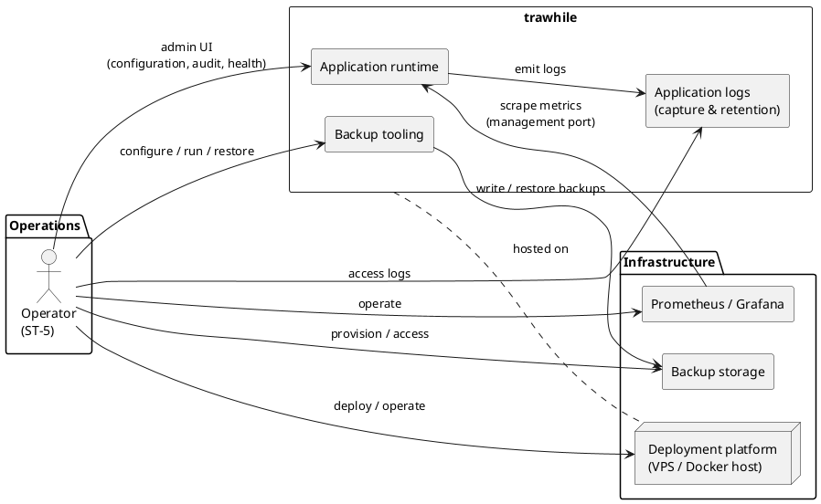

#### OSS security flow context

trawhile is a non-commercial OSS project; it therefore does not require a CRA manufacturer flow. This view shows the public security and release-evidence flows the project maintains as good OSS practice and for transparency. GitHub is the public project and release-evidence surface: source, releases, SBOMs, OpenAPI specifications, vulnerability intake, and Security Advisories. The deployed instance has no anonymous content surface: SBOM is published only as a GitHub release artifact, and the OpenAPI specification, running version, and About-page content are reachable only by authenticated users. ST-6 reports vulnerabilities via GitHub's private vulnerability reporting channel rather than through the deployed instance. The advisory relationship between GitHub and ST-5 (Operator) is pull-based: ST-5 subscribes their incident-response tooling to the per-repo Atom feed (or watches the repo for security alerts) to receive advisories. The deployed trawhile instance additionally queries GitHub for advisories affecting its running version and surfaces them in the admin UI as a defence-in-depth complement to the deployer's own subscription. If trawhile is later placed on the EU market in a commercial activity, CRA technical-file and ENISA reporting flows must be added.

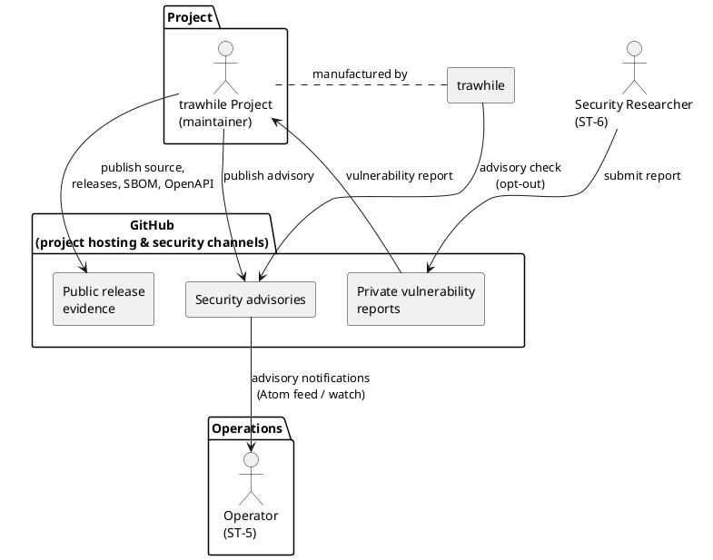

### Neighboring systems and actors

Neighboring systems, infrastructure, and external actors interact with trawhile across the system boundary. Infrastructure components are configured or operated by ST-5 but not developed. Application log capture and backup tooling are not listed as neighboring systems because the reference trawhile Docker Compose deployment provides them as part of the system-to-be. Regulatory frameworks are captured as constraints in the UR-C section, not as actors.

| Neighboring system / actor | Interaction with trawhile |
|---|---|
| OIDC providers (Google, Apple, Microsoft Entra ID, Keycloak) | OAuth2/OIDC authentication; provider supplies user identity (name, subject ID) at login |
| System Admin's email client | Receives the `mailto:` invitation link generated by trawhile; used to send the invitation to the invitee |
| API clients (incl. MCP, AI assistants) | Consume the trawhile API using an Account Holder's API key; MCP clients are the AI-assistant-targeted protocol variant of API clients |
| Monitoring stack (Prometheus-compatible) | Scrapes the management port metrics endpoint to monitor system health and trigger operational alerts; operated by ST-5 |
| Backup storage | Stores backup artifacts written by the trawhile-provided backup tooling; ST-5 provisions, protects, and grants access to the storage target |
| Container orchestration (Docker Compose) | Deployment orchestration; the trawhile project provides the reference Compose file including application-log capture, log retention, and backup tooling services, and ST-5 operates it |
| Deployment platform (VPS) | Provides compute, storage, and network; the system runs on a single VPS; operated by ST-5 |
| GitHub | Hosts the trawhile project; provides public source, releases, SBOMs, OpenAPI specifications, release evidence, the private vulnerability reporting channel, GitHub Security Advisories, operator advisory subscription mechanisms, and advisory data queried by trawhile |

## Use case overview

Functional decomposition by epic. Each epic groups related use cases; per-epic diagrams (inline at the start of each epic section) show the individual use cases and their UR identifiers. Actors represent stakeholder roles rather than access channels; per UR-00-C08, ST-2, ST-3, and ST-4 operations may be accessed through either an OIDC-authenticated browser session or that user's API key unless explicitly excluded. E-00 (Constraints) is not shown — it is a cross-cutting bucket of design-time conditions, not interactive use cases.

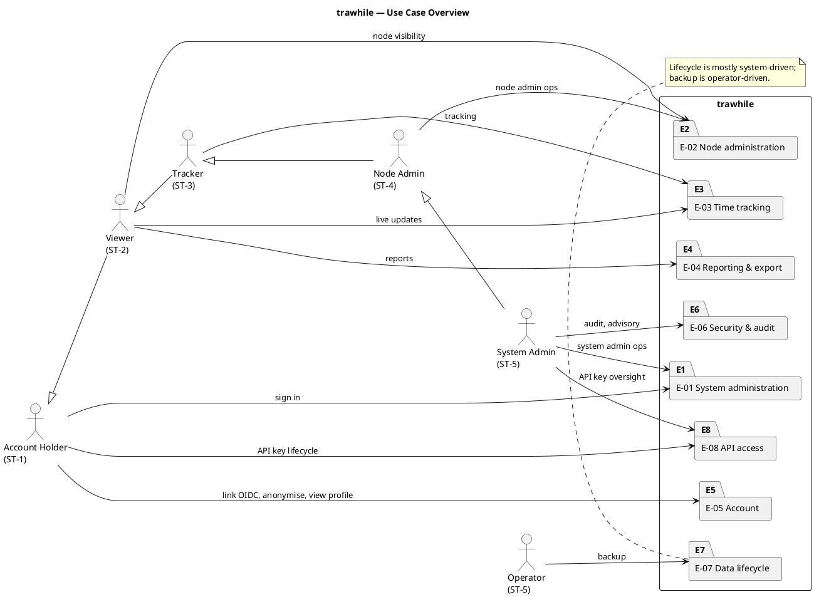

## Goals

| ID | Goal |
|---|---|
| G-1 | Enable companies to track time against a self-defined hierarchical node structure |
| G-2 | Provide fine-grained, recursively inherited authorization over node visibility and tracking |
| G-3 | Support accurate reporting and CSV export of tracked time |
| G-4 | Comply strictly with GDPR; collect only data necessary for operation |
| G-5 | Provide secure-by-default behavior and transparent OSS vulnerability handling |
| G-6 | Operate securely with minimal credential-management burden |

---

## Epic E-00 — Constraints

Constraints are design-time conditions satisfied by construction and verified by review, not by automated tests.

**Operational constraints**:
- UR-00-C01: One deployed instance serves exactly one company. [Rationale: data isolation; GDPR data controller boundary]
- UR-00-C02: User identity establishment is delegated entirely to OIDC; supported providers: Google, Apple, Microsoft Entra ID, Keycloak; at least one must be configured at startup. API keys provide subsequent delegated access for already-registered users and do not establish new identities. [Rationale: G-6; eliminates password storage]
- UR-00-C03: No email server is required; invitation emails are generated as mailto: links only. [Rationale: G-6; reduces attack surface]
- UR-00-C04: The planned frontend delivery channel is a responsive browser-based application; no separate native mobile application is planned at this time. [Rationale: operational simplicity and a single frontend codebase]
- UR-00-C05: The trawhile project is hosted on GitHub. GitHub's private vulnerability reporting is used as the inbound disclosure channel (UR-05-F06); GitHub Security Advisories are used as the outbound advisory channel (UR-06-F02). [Rationale: G-5; organizational constraint — project hosting and security-process platform; mature CVE-integrated workflows]
- UR-00-C06: The advisory-availability check from the deployed trawhile instance to GitHub shall be opt-out by the operator with a default-enabled value; the system shall continue to operate normally with the check disabled. [Rationale: G-5; supports air-gapped or network-restricted deployments while maintaining secure-by-default behavior]
- UR-00-C07: The reference Docker Compose deployment provided by the trawhile project shall include application-log capture, application-log retention enforcement, and backup-creation tooling; the operator remains responsible for provisioning the deployment platform and backup storage target, and for performing restore following project-provided documentation (UR-07-F02). [Rationale: G-5; keeps self-hosted operation simple for ST-5 while preserving operator control over infrastructure, storage custody, and restore execution]
- UR-00-C08: Operations available to a Viewer, Tracker, or Node Admin via an OIDC-authenticated session shall also be available through API keys issued for that account with equivalent semantics, except for operations reachable only through an OIDC-authenticated session: (a) mutating Account Holder operations and reads of the Account Holder's own profile data; (b) System Admin operations; (c) operations requiring OIDC interaction. API key access therefore covers delegated Viewer (ST-2), Tracker (ST-3), and Node Admin (ST-4) operations, plus explicitly API-key-enabled authenticated transparency reads. [Rationale: G-1, G-5; predictable delegation of user capabilities to API and MCP clients, with sensitive irreversible actions kept under interactive control to reduce the impact of a leaked or misused API key]
- UR-00-C09: The trawhile project shall include automated tests of the backup-creation tooling that verify produced artifacts are valid and sufficient to support restore via the documented procedure. [Rationale: G-5; since restore is performed by the operator from documented instructions rather than project-provided tooling (UR-07-F02), the documented procedure must be grounded in a tested, known-good backup-artifact format.]

**Domain constraints**:
- UR-00-C10: All timestamps are stored and exchanged in UTC. [Rationale: unambiguous time representation; GDPR audit trail integrity]
- UR-00-C11: No email addresses are stored for registered users. [Rationale: G-4; GDPR Art. 5(1)(c) data minimisation]
- UR-00-C12: The system must be deployable via Docker Compose on a single VPS without a container orchestration platform. [Rationale: G-5; operational simplicity for self-hosting companies]
- UR-00-C13: Pending invitations shall expire automatically after 90 days; they shall not be stored indefinitely. [Rationale: G-4; GDPR Art. 5(1)(e) storage limitation]
- UR-00-C14: trawhile application logs (operational, diagnostic, and audit log stream captured by the trawhile-provided logging infrastructure) shall not contain personal data. Identifiers in these logs shall be excluded, masked, or pseudonymised at emission, and request/response payloads shall not be logged in full. [Rationale: G-4, G-5; GDPR Art. 5(1)(c) data minimisation, Art. 25 data protection by design; secure-by-default operation]
- UR-00-C15: trawhile application logs shall be retained by the trawhile-provided logging infrastructure for exactly 3 years; the retention period is fixed and not operator-configurable. Retention shall be enforced by the log pipeline configuration, not by manual deletion. [Rationale: G-4, G-5; GDPR Art. 5(1)(e) storage limitation; aligned with the data retention period so audit and operational evidence remain available for the same window as the underlying records; fixing the value removes operator misconfiguration risk and inadvertent retention drift.]
- UR-00-C16: trawhile application logs shall include correlation identifiers (request ID, trace ID, session ID, pseudonymised user ID where an actor is known) on every entry, sufficient to associate related events across components and time. [Rationale: G-5; complements UR-00-C14 by ensuring ST-5 can investigate incidents without payload reconstruction; the no-full-payload rule is workable only if entries can still be correlated across services and request boundaries.]
- UR-00-C17: The data retention period is fixed at 3 years, measured to the second from the current moment. Time records past the retention boundary are permanently deleted by the next purge; the boundary is evaluated against the end of each record's counted duration. Nodes are deleted by the purge operation once their subtree holds no remaining time records and the node itself is older than the retention boundary. The retention period is not operator-configurable. [Rationale: G-4; GDPR Art. 5(1)(e) storage limitation. 3 years compromises between 2 years (insufficient retrospective view) and 5 years (excessive); accounting needs are served by aggregated reports, not long-term record retention. Fixing the value prevents accidental data loss from operator error and avoids re-notifying users on policy changes.]
- UR-00-C18: All UI text, including GDPR-sensitive screens, shall be rendered in the language derived from the user's browser locale (best match against English, German, French, Spanish; default English). [Rationale: G-4; user accessibility and informed consent on GDPR-relevant screens; the bounded language set keeps translation effort manageable.]

**Security constraints**:
- UR-00-C19: Request rates shall be limited on all OAuth2 and API endpoints to prevent abuse and brute-force attacks. [Rationale: G-5; OWASP]
- UR-00-C20: All HTTP responses shall include security headers (Content-Security-Policy, Strict-Transport-Security, X-Frame-Options, X-Content-Type-Options, Referrer-Policy). [Rationale: G-5; OWASP]
- UR-00-C21: All state-mutating endpoints shall be protected against cross-site request forgery. [Rationale: G-5; OWASP]
- UR-00-C22: No anonymous response (error pages, HTTP response headers, login pages, or any endpoint accessible without authentication) shall reveal information that fingerprints the deployed trawhile instance — including its version, dependency set, OpenAPI surface, or outbound network behaviour. [Rationale: G-5; defence-in-depth against bot-driven vulnerability discovery; with /about auth-gated per UR-05-F06 and the deployed instance offering no anonymous content surface, this constraint extends the same posture to the small remaining anonymous surfaces (errors, headers, OIDC callbacks).]

---

## Epic E-01 — System administration

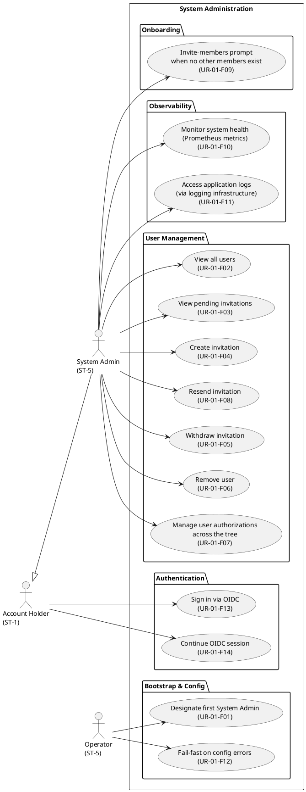

**Bootstrap**
- UR-01-F01: The operator shall be able to designate a first System Admin so that the system can be bootstrapped without prior in-app user management. [Goal: G-2]

**User management**
- UR-01-F02: The System Admin shall be able to view all registered users. [Goal: G-1]
- UR-01-F03: The System Admin shall be able to view all pending invitations. [Goal: G-1]
- UR-01-F04: The System Admin shall be able to create an invitation for a person by email address, generating a mailto: link to send manually. [Goal: G-1]
- UR-01-F05: The System Admin shall be able to withdraw a pending invitation. [Goal: G-1]
- UR-01-F06: The System Admin shall be able to remove a user from the company via a guided confirmation wizard. [Goal: G-1, G-4]
- UR-01-F07: The System Admin shall be able to manage node authorization assignments of a user across the tree: view all assignments, and grant or revoke authorizations on any node within their scope (same operation as UR-02-F07/UR-02-F08, accessed via node picker rather than user picker). [Goal: G-2]
- UR-01-F08: The System Admin shall be able to resend a pending invitation, resetting its expiry and generating a fresh mailto: link, without affecting the user record or assigned authorizations. [Goal: G-1]

**Onboarding**
- UR-01-F09: The System Admin shall be presented with a prompt to invite members upon login whenever no other members exist; this includes immediately after their first bootstrap login. [Goal: G-1]

**Observability**
- UR-01-F10: The System Admin shall be able to monitor system health and receive alerts on operational failures — including purge job non-completion, database transaction errors, and abnormal event rates — via a Prometheus-compatible metrics endpoint. [Goal: G-5]
- UR-01-F11: The System Admin shall be able to access trawhile application logs captured by the trawhile-provided logging infrastructure for diagnostic and incident-response purposes. [Goal: G-5]

**Configuration validation**
- UR-01-F12: The operator shall be informed of configuration errors at startup via a descriptive error message identifying the invalid property or constraint, so that misconfigured instances fail fast rather than starting in a broken or partially functional state. [Goal: G-5]

**Authentication**
- UR-01-F13: The Account Holder shall be able to sign in using a configured OIDC provider. For an invited person without an active profile, the first successful OIDC callback shall activate the account only if it matches a still-pending invitation; otherwise, sign-in requires an OIDC provider account already linked to the account. [Goal: G-6]
- UR-01-F14: Once signed in via OIDC, the Account Holder shall be able to make subsequent requests within the same browser-based session without re-authenticating, until they explicitly sign out or the session expires. [Goal: G-6]

## Epic E-02 — Node administration

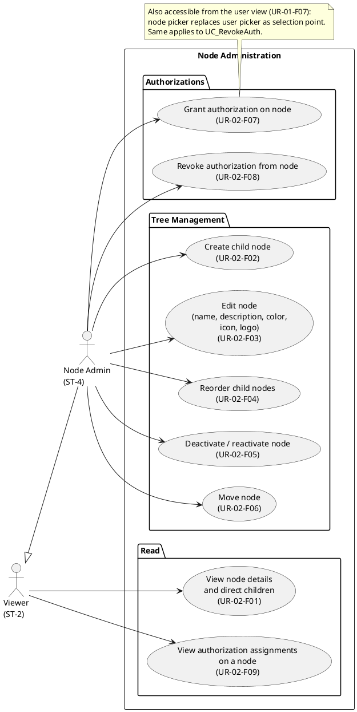

- UR-02-F01: The Viewer shall be able to view the details and direct children of any node on which they hold at least `view` authorization (effective, per the recursive grant rule). [Goal: G-1]
- UR-02-F02: The Node Admin shall be able to create a child node under any node within their scope. [Goal: G-1]
- UR-02-F03: The Node Admin shall be able to edit the name, description, color, icon, and logo of any node within their scope. Logo uploads are limited to 256 KB and common image formats. [Goal: G-1]
- UR-02-F04: The Node Admin shall be able to reorder the child nodes of any node within their scope. [Goal: G-1]
- UR-02-F05: The Node Admin shall be able to deactivate or reactivate any node within their scope. [Goal: G-1]
- UR-02-F06: The Node Admin shall be able to move a node to a different parent, provided they have admin rights on both the node and the destination parent, and the destination is not within the node's own subtree. [Goal: G-1]
- UR-02-F07: The Node Admin shall be able to grant `view`, `track`, or `admin` authorization on any node within their scope to any existing user; this operation is accessible both from the node view and from the user view (UR-01-F07). Granting `admin` on the root node makes the user a System Admin. [Goal: G-2]
- UR-02-F08: The Node Admin shall be able to revoke a user's authorization on any node within their scope, provided the user is not the last `admin` of that node; this operation is accessible both from the node view and from the user view (UR-01-F07). Revoking `admin` on the root node removes System Admin rights. [Goal: G-2]
- UR-02-F09: The Viewer shall be able to view all authorization assignments on any node on which they hold at least `view` authorization, distinguishing direct assignments from those inherited from ancestors. [Goal: G-2]

## Epic E-03 — Time tracking

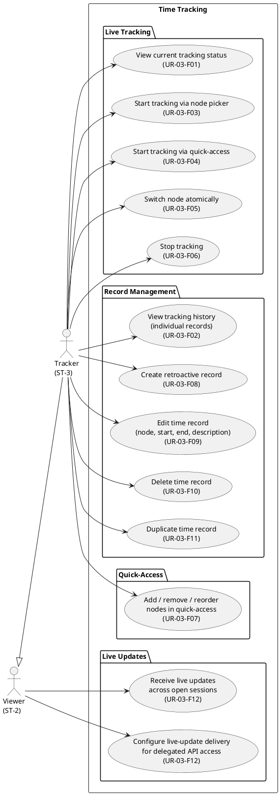

- UR-03-F01: The Tracker shall be able to view their current tracking status, including the node being tracked, elapsed time, start time, and description (if set). [Goal: G-1]
- UR-03-F02: The Tracker shall be able to view their recent time record history as a chronological list of individual records (in contrast to reports, which are always aggregated — see UR-04-F01). [Goal: G-1]
- UR-03-F03: The Tracker shall be able to start tracking a task by navigating the node tree using the node picker widget, with an optional description. Non-trackable or deactivated nodes are shown for navigation but not selectable for starting live tracking. [Goal: G-1]
- UR-03-F04: The Tracker shall be able to start tracking a task from a personal quick-access list, with an optional description. [Goal: G-1]
- UR-03-F05: The Tracker shall be able to switch to a different node atomically, without an explicit stop step. [Goal: G-1]
- UR-03-F06: The Tracker shall be able to stop tracking. [Goal: G-1]
- UR-03-F07: The Tracker shall be able to add, remove, and reorder nodes in their quick-access list. [Goal: G-1]
- UR-03-F08: The Tracker shall be able to create a time record retroactively for any node currently trackable by them, with an optional description. [Goal: G-1]
- UR-03-F09: The Tracker shall be able to edit the node, start time, end time, and description of any of their own time records. [Goal: G-1]
- UR-03-F10: The Tracker shall be able to delete any of their own time records. [Goal: G-1]
- UR-03-F11: The Tracker shall be able to duplicate a time record, specifying a new start and end time; the description is copied from the original. [Goal: G-1]
- UR-03-F12: The Viewer shall see live updates, across all their open browser sessions, whenever their visible node structure or authorizations change. The Tracker shall additionally see live updates whenever their tracking state changes. The Viewer shall be able to configure live-update delivery for delegated API access so that authorized API consumers can receive the same change notifications via an outbound delivery mechanism that tolerates transient failures. [Goal: G-1]

## Epic E-04 — Reporting & export

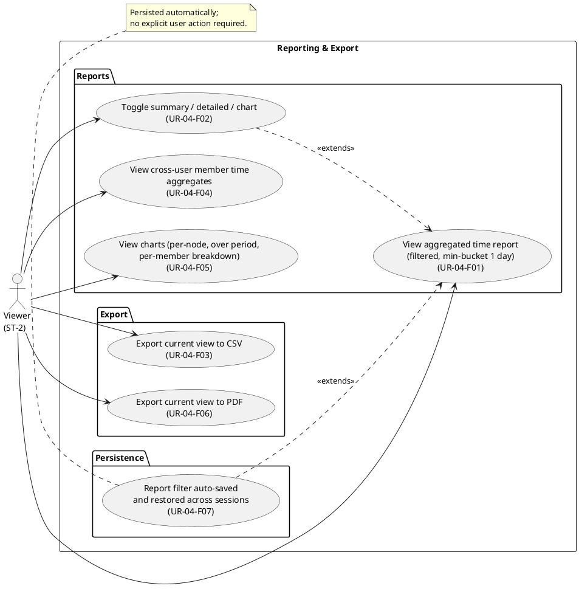

- UR-04-F01: The Viewer shall be able to view a time report aggregated over a user-selected date interval (daily, weekly, monthly, yearly, year-to-date, month-to-date) with a minimum granularity of one day, filtered by date range, user, and node, and limited to nodes visible to them. Individual time records are not exposed via reports; the per-record-detail surface is the tracking history (UR-03-F02). [Goal: G-3]
- UR-04-F02: The Viewer shall be able to toggle a time report between summary view (per-node totals per time bucket), detailed view (further split by record description), and chart view (per UR-04-F05). [Goal: G-3]
- UR-04-F03: The Viewer shall be able to export the current report view to CSV. [Goal: G-3]
- UR-04-F04: The Viewer shall be able to view the total time tracked by other members on nodes visible to them, aggregated over any full-day interval (daily, weekly, monthly, yearly, year-to-date, month-to-date); individual time record details shall not be visible. [Goal: G-1, G-4]
- UR-04-F05: The Viewer shall be able to view the following chart types in chart view, all respecting the active report filters: (1) time per node (bar or pie); (2) time over period (bar or line, bucketed by time interval); (3) per-member breakdown (stacked bar per time bucket, limited to members visible to the requesting user). [Goal: G-3]
- UR-04-F06: The Viewer shall be able to export the current report view — whether a table or a chart — to PDF. [Goal: G-3]
- UR-04-F07: The Viewer shall be able to have their report filter settings automatically persisted and restored across sessions and devices. [Goal: G-1]

## Epic E-05 — Account

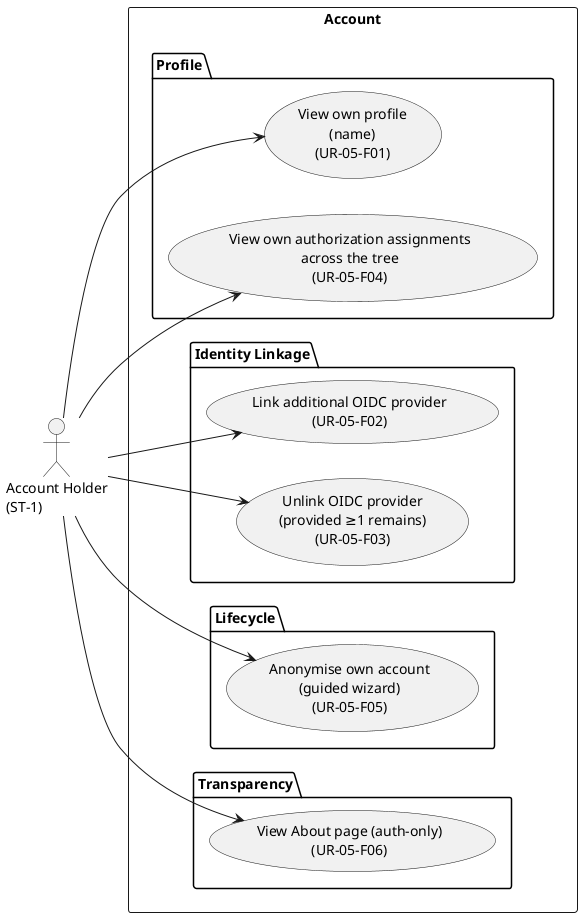

- UR-05-F01: The Account Holder shall be able to view their stored profile information (name). [Goal: G-4]
- UR-05-F02: The Account Holder shall be able to link an additional configured OIDC provider (Google, Apple, Microsoft Entra ID, or Keycloak) to their account. [Goal: G-1]
- UR-05-F03: The Account Holder shall be able to unlink an OIDC provider from their account, provided at least one other provider remains linked. [Goal: G-1]
- UR-05-F04: The Account Holder shall be able to view all their node authorization assignments across the tree. [Goal: G-2]
- UR-05-F05: The Account Holder shall be able to anonymise their own account via a guided confirmation wizard, irreversibly removing the link between their person and any retained trawhile activity history while preserving that history until the retention period removes it. [Goal: G-4]
- UR-05-F06: Any authenticated Account Holder (via OIDC session or API key) shall be able to view the About page, including the running application version, third-party licenses, a downloadable OpenAPI specification, a permanent summary of what personal data is stored and how long it is retained, the outbound network connections the instance makes (including the security-advisory check, when enabled), a link to trawhile's security vulnerability disclosure channel, and a link to the security advisory channel where the trawhile project publishes vulnerability and incident notifications. The About page is not reachable without authentication. SBOM is not served by the instance; it is published as a GitHub release artifact. [Goal: G-4, G-5]

## Epic E-06 — Security & audit

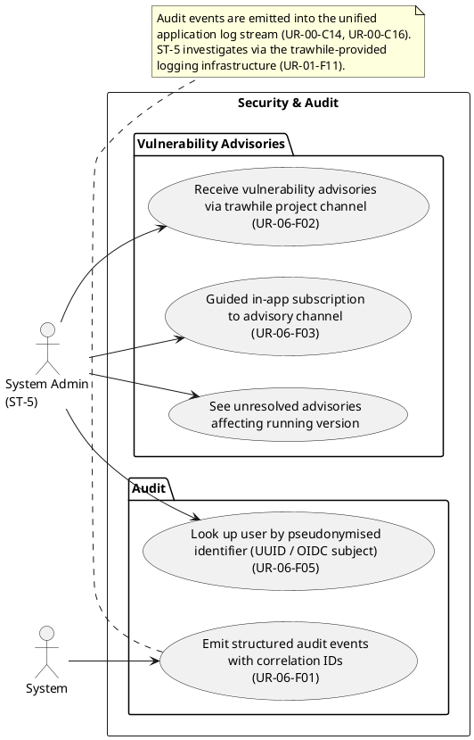

- UR-06-F01: The system shall emit audit-relevant events (authentication outcomes, authorization changes, user lifecycle changes, anonymisation) as structured records into the trawhile application log stream, each carrying event type, actor identifier, target identifier, timestamp, and the correlation identifiers per UR-00-C16 so audit events can be linked with related operational entries during investigation. Records comply with UR-00-C14; the System Admin investigates via the trawhile-provided logging infrastructure (UR-01-F11), resolving pseudonymous identifiers per UR-06-F05. [Goal: G-5]
- UR-06-F02: The System Admin shall be informed of vulnerabilities and security incidents affecting trawhile through an advisory channel published by the trawhile project, so that patches and mitigations can be applied in a timely manner; this channel shall be discoverable via the About page (per UR-05-F06). [Goal: G-5]
- UR-06-F03: The System Admin shall be guided within the application on how to subscribe to trawhile's security advisory channel, so that no external documentation is required. [Goal: G-5]
- UR-06-F04: The System Admin shall see, in the admin UI, any unresolved security advisories affecting the running version of trawhile, so that the operator is made aware that a redeployment with the patched version is required. [Goal: G-5]
- UR-06-F05: The System Admin shall be able to look up a user account by pseudonymised identifier (internal user UUID or OIDC subject), so that audit-relevant events found in the application log stream can be associated with the corresponding user without external mapping. [Goal: G-5]

## Epic E-07 — Data lifecycle

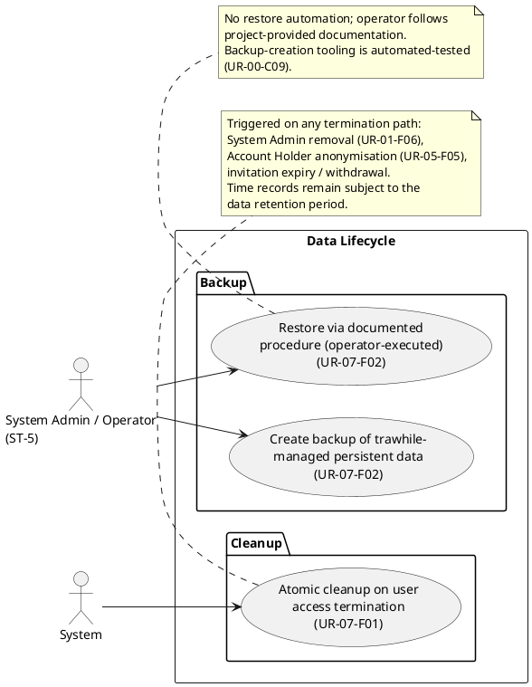

- UR-07-F01: When a user's access is terminated by any means, the system shall atomically clean up associated active state, anonymise identifying account data, and invalidate active delegated access; activity records associated with the user remain subject to the data retention period. [Goal: G-4]
- UR-07-F02: The operator shall be able to use trawhile-provided backup-creation tooling to create backups of trawhile-managed persistent data and write them to an operator-provisioned backup storage target. Restore is performed by the operator following project-provided documentation; trawhile does not provide restore automation, so responsibility for restore correctness rests with the documented procedure and the operator's execution of it. [Goal: G-5]

## Epic E-08 — API access

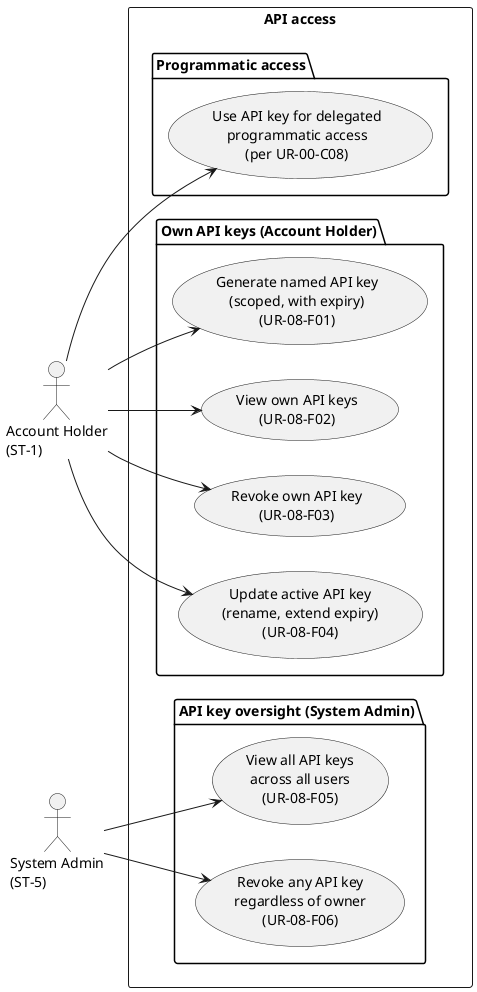

- UR-08-F01: The Account Holder shall be able to generate a named API key, specifying an authorization scope that is a subset of their own effective authorization (node scope and permission level) and a required expiry date; the raw key value is returned exactly once. [Goal: G-1]
- UR-08-F02: The Account Holder shall be able to view their own API keys, including name, scope, creation date, last-used date, expiry date, and active-vs-expired status. [Goal: G-1]
- UR-08-F03: The Account Holder shall be able to revoke any of their own API keys. [Goal: G-1]
- UR-08-F04: The Account Holder shall be able to update an active (non-expired, non-revoked) API key by renaming it or extending its expiry date; expired or revoked keys cannot be updated and must be replaced by generating a new key. [Goal: G-1]
- UR-08-F05: The System Admin shall be able to view all API keys across all users, including the owning user, name, scope, creation date, last-used date, expiry date, and status. [Goal: G-5]
- UR-08-F06: The System Admin shall be able to revoke any API key regardless of owner. [Goal: G-5]

---

## Key invariants

Business rules that hold unconditionally across all epics. An agent reviewing or implementing any feature must verify that none of these are violated.

- At most one open time record per user at all times.
- No time record counts for more than 24 hours, and open records exceeding this duration are eventually auto-closed by the system; enforcement mechanism and closure cadence are architectural decisions (immediate closure at 24h is not required).
- Open time records are excluded from reports and exports; only closed time records contribute to aggregates, detail rows, and charts.
- Starting a live tracking record requires the target node to be trackable for the user and active. Retroactive create and edit operations require the relevant node to be trackable for the user; the node need not be active.
- Time records of the same user shall not overlap in time; create, edit, and duplicate operations reject values that would overlap with another existing record of the same user.
- Cannot revoke the last `admin` authorization on any node.
- Cannot move a node into its own subtree.
- All timestamps are stored and exchanged in UTC.
- A user must exist before receiving any node authorization.
- Authorization is derived recursively upward: a grant on an ancestor is effective on all descendants.
- Only users with `admin` on a node may grant or revoke authorizations on that node or any descendant.
- Time records past the 3-year retention boundary are permanently deleted by the next purge; the boundary is evaluated against the end of each record's counted duration.
- A time record's `started_at` and `ended_at` cannot be set to a moment in the future or older than 3 years from the current time, and `ended_at` (when set) must be at or after `started_at`; create, edit, and duplicate operations reject values that violate these bounds.
- A time record's description, when set, shall not exceed a fixed maximum length (one-liner); descriptions can be added, modified, or cleared at any time, including while the record is open.
- Nodes are deleted by the purge operation when their subtree holds no remaining time records and the node itself is older than 3 years.
- The purge operation is idempotent on restart: an interrupted purge can be retried without deleting records outside the retention boundary or corrupting purge state.
- Anonymisation is irreversible; re-registration requires a new invitation and creates a new identity with no link to the anonymised account.
- Non-trackable nodes remain in a user's quick-access list, annotated with a non-trackable flag.
- Expired or revoked API keys are terminal: they cannot be renamed, re-scoped, re-activated, or have their expiry extended.
